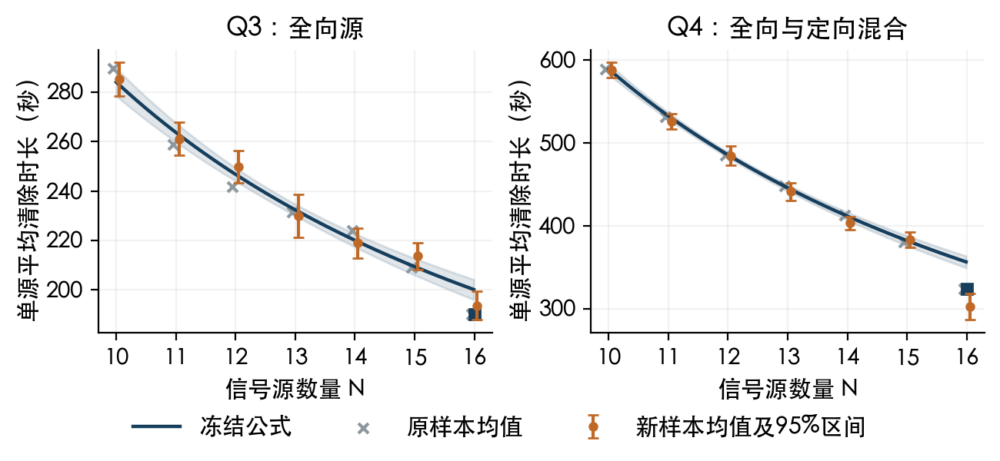

# 信号源数量与平均清除时长的关系

本节以默认方法78为对象，定义总源数为 $N$、全部清除的总虚拟时长为 $T$、单源平均时长为 $\tau=T/N$。结论限于本地场景分布及题设的 $10\le N\le16$。研究的是条件均值，源的位置、接收半径、方向及观测误差仍影响每一局的实际时间。

## 1 严格的计时关系

令 $L$ 为总行走距离（米），$S$ 为换频次数，$M$ 为测向次数，$F$ 为失败清除次数。全部清除时，成功清除次数等于 $N$，由题设费用得到

$$T=\frac L5+S+5M+3F+5N,\qquad \tau=5+\frac{L/5+S+5M+3F}{N}.$$

因此，源数量本身不唯一确定时长；需要考察上述各项如何随 $N$ 变化。

对默认控制器，记实际完成的发现点数为 $m$，源 $k$ 首次被发现时的发现点序号为 $J_k$。未占用的 $20-N$ 个频道必须在每个发现点检测；有源频道仅检测至首次发现。因此严格有

$$M_{\mathrm{disc}}=m(20-N)+\sum_{k=1}^{N}J_k.$$

每个发现点按频道顺序扫描未知频道，只有首次检测可能免换频。令 $d=M_{\mathrm{disc}}-S_{\mathrm{disc}}$，则 $0\le d\le m$。将其它测向和换频数记为 $M_{\mathrm{loc}},S_{\mathrm{loc}}$，得到

$$\boxed{\tau=\frac{L}{5N}+6m\left(\frac{20}{N}-1\right)+6\overline J+\frac{5M_{\mathrm{loc}}+S_{\mathrm{loc}}+3F-d}{N}+5,\quad\overline J=\frac1N\sum_kJ_k.}$$

这表明源增多会减少空频道的重复扫描，并使发现路程与共同开销分摊到更多源上。对 $N<16$，Q3的 $m=7$、Q4的 $m=21$；到 $N=16$ 时，已知源数上界允许停止余下发现，$m$ 可以下降。

## 2 可用于论文的均值模型

在固定策略与同一场景分布下，将总时长在有限数量范围内作仿射近似，并对16源的停止规则单设指示项：

$$\mathbb E[T\mid N]\approx A+BN+C\mathbf1_{\{N=16\}}.$$

由于给定 $N$ 后除数固定，严格有 $\mathbb E[T/N\mid N]=\mathbb E[T\mid N]/N$，故得到

$$\boxed{\mu(N):=\mathbb E[\tau\mid N]\approx B+\frac A N+\frac C N\mathbf1_{\{N=16\}}.}$$

这一低维模型对应共同成本分摊、净增量成本及上界停止修正。$A,B,C$ 为经验系数；它不是每个源具有固定独立定位成本的定理，$B$ 也不是不可为负的单次服务费用。

先用原独立集每问200局作事后关系建模，随后冻结公式，并在新种子2710001至2710200（每问另200局）验证，不用新样本重估参数。

按总时长作最小二乘估计，单位为秒，得到

$$\boxed{\widehat{\mu}_3(N)=60.01+\frac{2240.54}{N}-\frac{158.67}{N}\mathbf1_{\{N=16\}}}$$

$$\boxed{\widehat{\mu}_4(N)=-31.60+\frac{6206.85}{N}-\frac{513.96}{N}\mathbf1_{\{N=16\}}}$$

当 $N=10,\ldots,14$，模型中相邻数量的差为

$$\widehat\mu(N+1)-\widehat\mu(N)=-\frac{\widehat A}{N(N+1)}.$$

两问估计的 $A$ 均显著为正，因此该区间内预测的每源均时随源数增加而下降；15到16的变化另包含 $\widehat C/16$。这不是对所有固定空间布局的逐局单调性保证。

## 3 数值可信度与独立检验

系数区间使用HC3异方差稳健协方差与Student-t近似；均值带表示条件均值的不确定性，不是单局预测区间。HC3采用 $\widehat V=(X^\top X)^{-1}\sum_i[x_ix_i^\top e_i^2/(1-h_{ii})^2](X^\top X)^{-1}$，见[statsmodels官方实现说明](https://www.statsmodels.org/dev/generated/statsmodels.regression.linear_model.OLSResults.html)。

|问题|A及95%区间|B及95%区间|C及95%区间|
|---|---|---|---|
|Q3|2240.54 [2014.89, 2466.19]|60.01 [42.39, 77.62]|-158.67 [-276.63, -40.71]|
|Q4|6206.85 [5889.35, 6524.36]|-31.60 [-58.02, -5.18]|-513.96 [-826.58, -201.33]|

|冻结新样本验证|Q3|Q4|
|---|---:|---:|
|单源时长RMSE/秒|17.197|28.931|
|单源时长R²|0.746|0.906|
|总时长RMSE/秒|219.124|398.754|
|总时长R²|0.203|0.364|

总时长的解释力低于每源均时，说明空间布局、方向和观测误差仍有显著作用，不能由源数精确预测单局总耗时。

|源数|Q3预测每源/秒|Q3新样本均值/秒|Q4预测每源/秒|Q4新样本均值/秒|
|---|---:|---:|---:|---:|
|10|284.06|285.14|589.08|587.71|
|11|263.69|261.16|532.66|525.91|
|12|246.72|249.83|485.64|484.53|
|13|232.35|229.99|445.85|441.31|
|14|220.04|218.89|411.74|403.23|
|15|209.37|213.65|382.19|383.37|
|16|190.12|193.59|324.20|302.46|

阴影为拟合均值的HC3近似95%区间，误差棒为新样本分组均值的t区间；16处方点为包含停止修正项的预测值。

原400行默认策略记录逐行复现一致；800个剖析案例均通过计时和发现次数恒等式，最大计时残差0.00001384秒。新样本中16源的平均发现点数为Q3 5.966、Q4 14.724；其余数量分别固定为7和21。

## 4a 净增量系数的计费分解

下表将同一线性拟合的B系数按计时项目分解；各项相加等于总B，这是计费恒等分解，不是因果效应估计。

|项目|Q3的B分量/秒|Q4的B分量/秒|
|---|---:|---:|
|行走|67.44|54.11|
|发现扫描|-28.02|-105.46|
|已知源补测|15.12|10.99|
|失败清除|0.46|3.77|
|成功清除|5.00|5.00|

Q4的负B主要对应发现扫描减少抵消新增行走与定位费用。不能把负B解释成负的单源操作费用。16源的验证均值仍与公式有明显差异，模型用于平均趋势与粗略估计，不替代逐局仿真。

## 4 直接写入论文的文字

“在本题固定20频道及既定发现覆盖策略下，未占用频道需要重复检测，有源频道在首次发现后退出发现扫描。由此可得发现测向次数恒等式 $M_{\mathrm{disc}}=m(20-N)+\sum_{k=1}^N J_k$。结合总时间计费规则，建立条件均值模型 $\mathbb E[T/N\mid N]\approx B+A/N+C\mathbf1_{\{N=16\}}/N$。两问的系数估计均表现为 $A>0$、$C<0$，对应共同开销分摊与达到已知源数上界后的提前停止。冻结新样本检验支持该有限范围内的平均下降趋势。该关系描述本地场景分布下的条件均值，不意味着所有布局逐局单调，也不应外推到题设数量范围以外。”

## 5 复现与适用范围

- 方法78，题设源数10至16；Q3全向，Q4全向与定向混合。
- 本地普通场景使用40米位置排斥采样、均匀提议半径和朝向、固定位置误差场。结论不是官方成绩规律。
- 原200局用于事后建模，新200局用于冻结验证；没有把新验证结果并回系数估计。
- 代码和原始逐局记录见本目录 `src/`、`results/`，统计字段见 `artifacts/count_time_results.json`。
- 先在本目录编译 `clang++ -O2 -std=c++17 src/count_profile.cpp -o count_profile`，再运行 `python3 src/run_profiles.py`、`python3 src/analyze_count_time.py`、`python3 src/build_count_report.py`。重跑会覆盖本目录生成结果，冻结原始交付不变。
