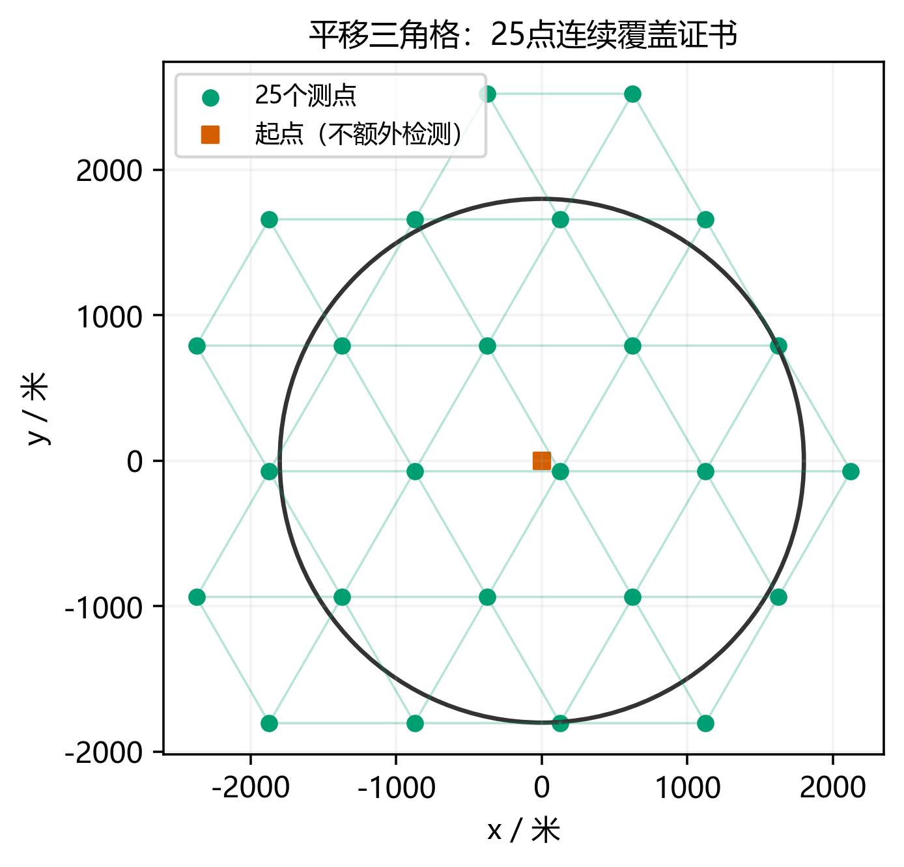
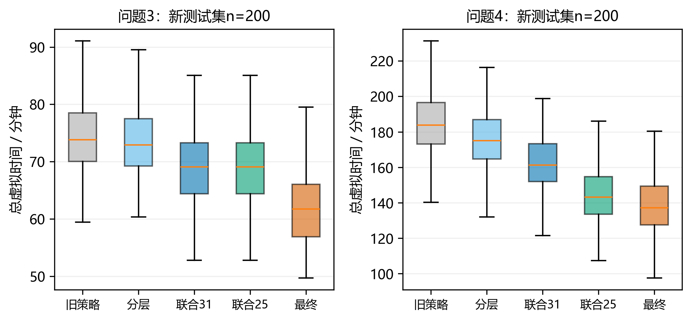
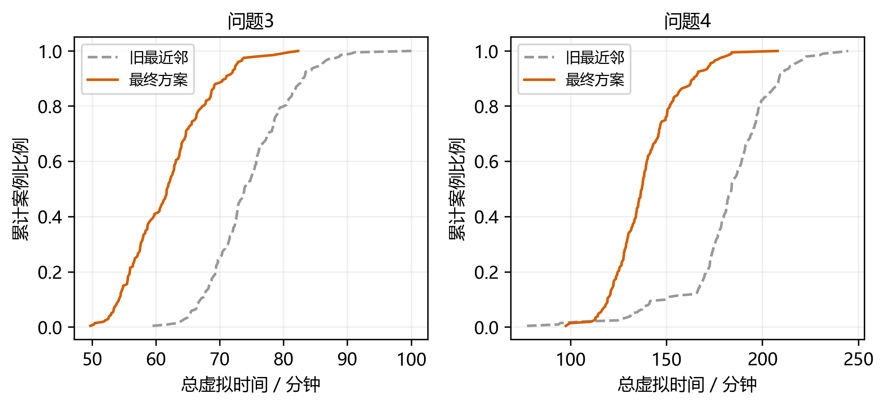

# 本轮结论与替换摘要

本轮保留首版的角锥定位、最小包围圆、真实动作计费和有限光学兜底，补强三个部分：问题2从离散评分提升为带全局差距界的连续设计；问题4将31点固定三角格缩减为25点带连续证书的平移布局；问题3/4用联合滚动路线及已有停靠点补测，降低实际行走成本。首版全部源文件、数据、文档和压缩包未覆盖，本轮代码与证据独立存于`B题优化`。

**可替换摘要：** 针对无线电干扰源数目未知、有界测向误差和定向辐射引起的漏检，建立以全清除为约束、真实动作总时间为目标的搜索定位模型。以角锥交维护保守位置集合，以最小包围圆代替区域直径判定单点清除。在完整首次观测扇区下，将第二点定位质量建模为连续minimax问题，构造双位置见证下界和角度区间分支上界，并用有理数运算验证：候选点$(850,\pm400)$米的最坏包围半径不超过64.473米，在给定候选区C内与连续minimax最优值的差距不超过0.00071米；考虑实际0.01°读数量化后，差距不超过0.08831米。对全向源沿用七点连续覆盖，对混合源构造25点平移三角格，证明其覆盖任意位置和180°发射朝向，并给出固定通用布局至少14点的下界。为压缩占时最多的移动，联合规划剩余覆盖点和已发现目标的开放路径，以多起点最近邻加2-opt滚动重规划，并利用已有停靠点补充有效基线观测。在未参与开发的新测试集中，两问各200局均全部清除，平均单源时间为285.28秒和646.76秒；相对同案例旧方案，总时间分别下降17.08%和23.63%。五组1000局压力测试及原模拟器66局跨实现验证均全部清除。本地性能不代表官方隐藏案例，连续几何最优性、固定布局最优性和实际任务路线最优性分别限定，不混用证明结论。

**关键词：** 有界误差；连续minimax；有理数证书；凸包覆盖；滚动路径；主动测向。

**与首版的关系。** 问题1的推导和反例无需改变。问题2以第2节替换原有限场景评分结论；问题4的31点方案改为基线，采用第3节25点布局；问题3/4调度替换为第4节。正式测试状态不变：六次官方成绩及原名加密日志仍未取得，不能用本轮本地测试替代。

# 问题2：从离散评分到连续近最优证书

## 问题与适用范围

在首次测点的坐标系中令首次显示方位为0°，$u=(1,0)$、$v=(0,1)$。物理误差限为1°，加两位小数量化后的闭外包半角为 $\epsilon=1.005^\circ$。本节研究完整首扇区

$$P_1=\{r(\cos\phi,\sin\phi):5<r\le1500,\quad |\phi|\le\epsilon\},$$

以及第二测点候选区

$$\mathcal C=\{(a,b):650\le a\le850,\quad200\le|b|\le400\}.$$

该扇区不包含额外的目标圆域裁剪；例如首点在原点时，整个1500米扇区位于1800米目标圆域内，正好满足此模型。对于一般首点，经地图裁剪后的 $P_1$ 更小，本节**上界仍有效，具体实例的近最优差距不保证保持**。不将完整扇区最优性推广成任意信息状态下的最优性。

沿用首版连续距离极值证明，$\max_{q\in\mathcal C,z\in P_1}\|q-z\|=950.708979<1000$，故全向第二次检测可保证接收。接收半径范围不是源距下界；同地重测不能消除固定误差。

令 $W(q,\theta;\epsilon)$ 为半角 $\epsilon$ 的前向角锥，$\rho$ 为最小包围圆半径，定义连续外包模型

$$F_c(q)=\sup_{\theta\in\Theta_c(q)}\rho\big(P_1\cap W(q,\theta;\epsilon)\big),\qquad F_c^*=\inf_{q\in\mathcal C}F_c(q). \tag{1}$$

集合可取闭包计算半径；删除$r\le5$的近距离内孔不会削弱上界，而下界见证均远大于5米。连续模型把两位小数读数的有效误差外包为连续区间，因此与真实物理量化模型 $F_{\rm quant}$ 分开报告。

## 全部连续读数的上界

对读数区间 $I=[\theta_0-\delta,\theta_0+\delta]$，当 $\epsilon+\delta<90^\circ$ 时有

$$\bigcup_{\theta\in I}W(q,\theta;\epsilon)\subseteq W(q,\theta_0;\epsilon+\delta). \tag{2}$$

因此只需对扩角后集合求一个覆盖圆，就获得该**整个连续区间**的上界，而非仅检查端点或中点。计算以完整角度范围$[-182^\circ,2^\circ]$的8个区间开始，足以包住所有可能第二读数；不能接受的区间二分。实际源在第二点下方，真实方位处于$(-180^\circ,0^\circ)$，加入误差后仍落在初始范围。

为使证书独立于浮点舍入，程序采用以下验证结构：Machin公式及交错级数余项给出$\pi$和正余弦的有理数外包；以有理系数半平面构造首扇区和扩角锥外包多边形；浮点仅用于建议圆心，最后以精确Fraction有理数验证全部顶点的距离平方不超过给定半径平方。若全部顶点通过，凸性保证整个多边形被覆盖。初始首扇区用轴向上界、角锥边和圆盘切线外包，绝不使用内接近似作为上界。

独立程序共处理166个区间节点，叶区间无缝覆盖初始角度范围，对 $q=(850,400)$ 认证

$$F_c(850,400)\le64.473\ {\rm m}. \tag{3}$$

同一上界还覆盖全部合法量化读数。证书保存分支叶子、有理数圆心与参数；复现时重新执行精确裁剪和顶点验证，数值提案本身不被信任。

## 对整个连续候选区的下界

仅固定$q$求出连续上界还不能称为连续最优设计。为此构造两个在同一读数下不可区分的合法位置。令 $R=1500$，取略内收的首半角 $e_1=1.00499999^\circ$，第二半角 $e_2$，设

$$A=R(\cos e_1,-\sin e_1),\qquad B=t(\cos e_1,\sin e_1).$$

令从$q=(a,b)$观测两位置的夹角为$2e_2$，由两射线的叉积关系可解得

$$t=\frac{R(ka+hb)-s(a^2+b^2)}{R\ell+hb-ka}, \tag{4}$$

其中 $k=\sin(e_1+2e_2)$、$h=\cos(e_1+2e_2)$、$s=\sin(2e_2)$、$\ell=\sin(2e_1+2e_2)$。这里$h$仅为本节三角函数简记，网格边长在后文记为$H$。

若两个位置均能产生相同第二读数，其后验集合至少包含$A,B$，于是

$$F(q)\ge\tfrac12\|A-B\|=\tfrac12\sqrt{R^2+t^2-2Rt\cos(2e_1)}. \tag{5}$$

需要证明这一见证对**全部**$a\in[650,850],b\in[200,400]$成立。有理区间核验给出分母为正、$5<t<R\cos(2e_1)$，且$A-q,B-q$均向右下方，排除叉积方程的反向射线解。偏导分子为

$$\begin{aligned}
D^2t_a={}&R^2k\ell+2Rkhb-2saR\ell-2sahb+sk(a^2-b^2),\\
D^2t_b={}&R^2h\ell-2Rhka-2sbR\ell+2skab+sh(a^2-b^2),
\end{aligned}$$

其中$D=R\ell+hb-ka$。对整个候选矩形作有理区间代入，两者下界均严格为正。因此$t$随$a,b$增大而增大，而式(5)在$t<R\cos(2e_1)$时随$t$严格减小，故该全域下界在$(850,400)$处达到最小值。$b<0$情形由反射对称得到。

在连续模型取$e_2=1.00499999^\circ$，认证

$$64.47229\le F_c^*\le F_c(850,400)\le64.473, \tag{6}$$

$$0\le F_c(850,400)-F_c^*\le0.00071\ {\rm m}. \tag{7}$$

因此本节取得的是**在候选区C内误差不超过0.71毫米的连续全局近最优设计**，没有把有限样本最小值冒充精确最优值，也不声称差距恰为0。

## 实际0.01°量化模型

真实读数必须落在0.01°格点上。下界中取$e_2=0.99999999^\circ$，将两真实方位中点舍入至最近0.01°显示角。显示角偏移不超过0.005°，两见证方位到显示值的距离均小于1.005°，所以各自可通过不超过1°的物理误差落入该显示值的开舍入区间。略内收的角度避免依赖未知的舍入平局规则。两位置的首次显示值也都可以为0.00°。

以此认证

$$64.38469\le F_{\rm quant}^*\le F_{\rm quant}(850,400)\le64.473,$$

$$F_{\rm quant}(850,400)-F_{\rm quant}^*\le0.08831\ {\rm m}. \tag{8}$$

这是量化物理模型的独立差距界，不能直接用连续中心角充当合法显示读数。附带的long-double穷举结果可作诊断，但式(6)—(8)依赖的是有理数证书。

**在线参数说明。** 上述目标只优化第二观测后的最坏几何半径，不包含移动时间。最终问题3/4程序保留$(750,\pm300)$局部测点，因为整任务目标是时间，不能自动把纯精度最优点换入后宣称更快。该区别保留在论文中；后续若比较850/400的任务性能，需另作预声明实验。

# 问题4：25点连续覆盖及数量下界

## 可行布局由31点降到25点

将三角格边长记为$H=999$米，基向量为 $(H,0)$ 和 $(H/2,\sqrt3H/2)$。平移后格点为

$$s_{ij}=H\left(i+\tfrac16+\tfrac12(j+\tfrac{11}{12}),\ \tfrac{\sqrt3}{2}(j+\tfrac{11}{12})\right). \tag{9}$$

保留所有与半径1800米闭圆域相交的闭等边三角形的三个顶点。独立有理坐标枚举确认：共有33个相交单元、25个不同顶点。最近被排除单元到原点的最小距离为1802.415372米，筛选裕量2.415372米；最远测点半径2599.480417米。接收距离裕量为1米，坐标双精度往返误差远小于该量级。

任意源位于一个保留三角形内，距三顶点均不超过999米，并属于三点凸包。对任意发射单位方向$n$，不可能三个顶点均满足$n^\top(s-z)<0$，否则凸组合会推出$0<0$。至少一点处于含边界的180°辐射区且在1000米内，因此连续发现保证保留。

25点方案不额外在原点检测。机器狗仍从原点出发，直接前往所选测点；原点初始位置不等于必须执行检测。开发时还比较过“25点加原点”的26点版本，冻结选择由开发结果决定。

{width=100%}

## 为什么仍不能宣称25点最少

这里优化的是**有限固定通用测点集**，要求对所有$z\in\Omega$均有$z\in\operatorname{conv}(S_z)$，其中$S_z=\{s:\|s-z\|\le1000\}$。它不等于自适应策略的最少动作数。

首先，对除有限测点对连线之外的几乎所有$z$，其近邻至少有3个；否则$z$无法处在近邻凸包内。积分得

$$\sum_{s\in S}\operatorname{area}\big(\Omega\cap B(s,1000)\big)\ge3\pi1800^2. \tag{10}$$

其次考虑圆周上沿外法向发射的源。对半径为$r\ge1800$的测点，能够检测的圆周半角$\delta$满足

$$\cos\delta\ge\max\left\{\frac{1800}{r},\frac{r^2+1800^2-1000^2}{2r\cdot1800}\right\}.$$

两项在$r=\sqrt{1800^2+1000^2}$相等，最大半角为$\arctan(1000/1800)$，故至少需要

$$\left\lceil\frac{\pi}{\arctan(1000/1800)}\right\rceil=7$$

个严格圆外测点。圆内测点无法接收上述外向源；恰在圆周的点只能覆盖零弧长位置。每个圆外测点的1000米盘与目标域交集面积不超过半盘，其余点至多贡献整盘。因此若共有$N$点，

$$3\pi1800^2\le(N-7/2)\pi1000^2\quad\Longrightarrow\quad N\ge14. \tag{11}$$

综合本轮构造得到

$$14\le N_{\rm opt}\le25. \tag{12}$$

这一界增强了对“足够”与“必要”的区分，仍没有证明25最小。新布局比31点减少19.35%，实际耗时变化还取决于行程、发现顺序与局部定位，不能按点数比例直接推算。

# 问题3/4：联合滚动路径与停靠点补测

## 实际目标仍按动作计费

保持

$$T=L/5+N_s+5N_m+3N_f+5N_c. \tag{13}$$

清除不会改变接收频道；失败清除与补漏扫描均计时；同位置重复误差固定。旧测试表明移动占时超过80%，因此本轮主要减少移动，而非将几何计算加速冒充任务时间收益。

## 开路径2-opt与联合决策

在初始时刻和每完成一个覆盖扫描或局部定位清除节点后，构造当前待办节点：尚未访问的覆盖测点，以及所有已发现未清除频道的最小包围圆圆心。仅使用已收到的示向、near和clear结果，节点中没有真值位置、源数或发射方向。

对节点序列$\pi=(\pi_1,\ldots,\pi_m)$定义无须返回起点的代理开放路径

$$J(\pi)=\|p-s_{\pi_1}\|+\sum_{j=1}^{m-1}\|s_{\pi_j}-s_{\pi_{j+1}}\|. \tag{14}$$

从每个可能首节点生成最近邻初始路径，逐一执行2-opt，选取其中路径长度最小的解。2-opt反转片段$i{:}j$时，更新只涉及前边与后边；片段到末尾时不加不存在的返回边。单次局部改善只接受严格下降，最多100轮，避免无限循环。它保证返回的代理路径不比同批初始最近邻路径更长；**不保证代理TSP全局最优，更不保证真实总时间逐案例下降**。

每次仅执行所选路径的第一个节点：若是覆盖点，则扫描该处所有未发现频道；若是源节点，则调用有限局部定位清除。该节点完成后根据新的实际停点和信息重规划；一次扫描或局部定位内部的多个HTTP动作之间不重排全局路线。这样覆盖和定位的先后顺序被联合选择，不再强制到达一个覆盖点后立刻清完所有新发现源。

源节点圆心只是位置代理，局部清除可能还要访问额外测点。式(14)没有冒充精确动作成本，也没有使用不适用的Christofides近似比；真实收益统一由式(13)及配对实验衡量。

## 原地补测避免回到旧定位基线

若某已发现源只有一次示向，首点为$s_1$、首单位方向为$u$，机器狗已停在$p$，且

$$|\operatorname{cross}(u,p-s_1)|\ge50\ {\rm m},$$

先在当前点检测一次该频道。当前位置与首射线已有至少50米横向基线；若收到示向则直接更新位置集合，可能省去前往旧750±300米测点的路程；若无信号则只增加一次检测/可能换频，仍进入原有有限流程。该操作不移动，也不假定必须成功；它与原地重复同一观测取平均不同，因为首次观测发生在另一个位置。

50米为一次开发期指定的工程阈值，本轮未作参数扫描。其正确性只依赖“每源至多尝试一次”和保守集合更新，精度与耗时效果单独消融，不能全部归功于2-opt。

## 完备性及预算

每个全局节点最多访问一次，每次处理一个源节点都在有限步骤内清除该源；无论如何重排，未发现频道最终完成全部必要覆盖观测，已发现频道最终成功清除。正常退出只允许累计清除16个不同频道，或所有覆盖节点和待清除源节点均已完成。超时、拒绝或几何异常不产生全清除证书。

局部光学兜底仍用每格不超过28米的外接矩形网格，连续覆盖半径$14\sqrt2<20$，至多108次清除。原地补测使每源局部检测上界由8变为9，但不增加移动段。新布局最大半径增大，不能沿用旧3322米动作位置界。记目标域外切64边形的最大半径$R_p=1800\sec(\pi/64)$，则第二测点的半径不超过$2599.480417+\sqrt{750^2+300^2}$；最小圆心在凸定位区域内，横移点半径不超过$R_p+50$，光学外接矩形点的半径不超过$\sqrt2R_p$。三个界的最大值小于3408米，故本轮统一取3408米。以25全局点计，

$$N_m\le25\cdot20+16\cdot9=644,\quad N_{\rm clear}\le1776,$$

$$L\le[25+16(11+1)]\cdot6816+16\cdot107\cdot28=1527008\ {\rm m},$$

$$T\le1527008/5+6\cdot644+3\cdot1776+2\cdot16=314625.6\ {\rm s}=87.396\ {\rm h}<100\ {\rm h}. \tag{15}$$

这是极保守虚拟预算，条件仍是几何保持正确、请求合法串行且能在现实截止前完成。现实20分钟不能由虚拟上界证明；HTTP桥保留实际截止、未决超时中止和同ID重试规则。

# 冻结测试与改进归因

## 实验约定

开发集为种子1—40；新测试集为90001—90200，每问200局，旧10001—10200结果不用于本轮选择。布局搜索由C++枚举4种边长与24×24平移，使用格点数量和代理路长筛选；它只是有限设计族搜索，不是点集全局最小证明。最终参数、消融和压力种子写入冻结配置后再运行测试。

比较六种配置：旧31点最近邻、分层2-opt、联合31点、25点最近邻、联合25点、联合25点加原地补测。问题3的覆盖仍为七点，因此布局消融在问题3与旧布局相同。所有方法使用完全相同的源环境和固定空间误差场，不读取隐藏真值决策。总时间和平均单源时间按案例等权平均；同一局内的源不作为独立统计样本。配对区间对每个案例的时间差构造Student-t均值区间。

|题号|全清除|旧总均时/秒|新总均时/秒|新单源均时/秒|总均时下降|配对节省95%区间/秒|
|:--|:--|:--|:--|:--|:--|:--|
|3|200/200|4483.28|3717.34|285.28|17.08%|[715.54, 816.32]|
|4|200/200|10939.40|8353.95|646.76|23.63%|[2401.26, 2769.65]|

|配置|问题3总均时/秒|问题4总均时/秒|问题3较旧节省|问题4较旧节省|
|:--|:--|:--|:--|:--|
|旧最近邻|4483.28|10939.40|0.00%|0.00%|
|分层2-opt|4423.56|10503.04|1.33%|3.99%|
|联合31点|4151.72|9803.99|7.40%|10.38%|
|25点最近邻|4483.28|9912.29|0.00%|9.39%|
|联合25点|4151.72|8718.17|7.40%|20.30%|
|最终方案|3717.34|8353.95|17.08%|23.63%|

这里的基线是在新案例上重跑的旧算法。不能直接用首版另一测试集上的349.87/868.17秒与新值相除宣称改进百分比。

{width=100%}

## 哪些改动贡献最大

问题3：分层2-opt相对旧最近邻对应平均节省59.71秒；联合31点相对旧最近邻对应平均节省331.56秒；联合调度中31改25点对应平均节省0.00秒；25点联合调度中加入原地补测对应平均节省434.38秒。

问题4：分层2-opt相对旧最近邻对应平均节省436.37秒；联合31点相对旧最近邻对应平均节省1135.42秒；联合调度中31改25点对应平均节省1085.82秒；25点联合调度中加入原地补测对应平均节省364.21秒。

这些是对应消融之间的均值差；机制存在交互，不能把不同分母的百分比相加，也不能将联合调度和补测收益写成单独2-opt收益。

最优配对均值不等于逐案例支配。最终方案在问题3的200个案例中196个更快，问题4中189个更快，其余案例仍计入统计。覆盖证书维持的是完整性，时间收益是本地分布下的实验结论。

{width=100%}

## 压力与原模拟器验证

冻结后五类新压力组使用110001—150100的对应分段种子，每组每问100局，分别覆盖1000米接收半径和圆周向外、近共线和负端点误差、平滑相关误差、分区正负端点、重合/5米/20米近距离。共1000局全部清除。压力组不混入正常随机测试的均值区间。

|压力组|问题3全清除|问题4全清除|问题3单源/秒|问题4单源/秒|
|:--|:--|:--|:--|:--|
|边界向外|100/100|100/100|381.07|797.32|
|近共线|100/100|100/100|378.55|723.51|
|相关误差|100/100|100/100|288.63|657.50|
|端点误差|100/100|100/100|298.34|671.21|
|重合及近距离|100/100|100/100|310.33|922.07|

原Python模拟器独立物理核每问30局，种子160001—160030；真实本地HTTP每问3局，种子170001—170003。机器人为本轮C++独立程序，HTTP桥不读取真值。66局全部清除；通信故障9项仍通过。输出日志是本地明文演练，不是官方加密日志。

|题号|本地案例|清除数|平均单源/秒|桥接墙钟/秒|
|:--|:--|:--|:--|:--|
|3|LOCAL-170001|15|280.57|0.32|
|3|LOCAL-170002|15|224.35|0.22|
|3|LOCAL-170003|13|322.46|0.36|
|4|LOCAL-170001|15|541.87|0.53|
|4|LOCAL-170002|15|460.14|0.50|
|4|LOCAL-170003|13|675.29|0.61|

# 交付、独立审查与复现

## 与论文对应的新增代码

|文件|职责|
|:--|:--|
|`src/routing.hpp`|开放路径长度、多起点最近邻、2-opt反转与重规划|
|`src/policy.hpp`|25点布局、联合待办队列、原地补测与有限清除|
|`src/layout_search.cpp`|有限网格平移搜索，不宣称全局最少点|
|`src/experiment.cpp`|六组配对与五类压力实验|
|`src/robot.cpp`|冻结配置的独立C++机器人|
|`src/bridge.py`|复用经9项故障测试的串行HTTP客户端|
|`review/src/q2_rational_certificate.py`|Q2全连续候选区下界及连续读数上界的精确验证|
|`review/layout_exact_certificate.json`|25点与33单元的独立精确枚举|
|`src/analyze.py`|读入全部实际CSV、核对种子与清除计数、统计及绘图|

**边界说明：** 仿真与路由主循环为C++；Q2的精确证明验证采用Python标准库Fraction，以易核验的有理数运算处理少量证书节点，不承担批量仿真。绘图、统计和文档生成也由本地程序完成。

在`B题优化`目录运行`run_all.ps1`可编译并重跑主要配对、压力和原模拟器验证；`review/src/q2_rational_certificate.py`可以单独重建精确证书。默认冻结机器人已经启用25点联合路线和原地补测。官方模拟器就绪后，可运行`python src/bridge.py --problem 3 --team-id 实际队号 --log results/新日志名.jsonl`；问题4将题号改4。每局日志必须新建。

## 独立审查结论

Q2证书由独立数学agent完成，另一名reviewer重新运行并审查方位区间、前向射线、矩形单调性、圆盘外包、合法量化见证及地图裁剪条件。路线/布局reviewer用独立有理数枚举复核25点，检查300组路由契约、500次空源扫描和168组边界定向单源；单源和空源仅为验证部件完整性的诊断，不冒充题面10—16源正式案例。

最终模拟评分初评93/100，针对五项文字及证明呈现问题作有界复核后为**97/100（交接质量）**，提交就绪度77/100。分数来自自拟量表的AI模拟，不是官方评分或获奖预测；首版问题1与本补充共同构成评分对象。

本轮实际修订包括：恢复公式中被字符串转义破坏的单位和下标；在摘要明确近最优范围是给定候选区C；将重规划粒度修正为完成扫描/局部定位节点后；直接写明每个消融差值的对照；补齐3408米动作位置界的控制链。独立3400行原始数据核验和Q2精确证书复跑均通过，未发现尚未修复的核心数学或统计错误。

原稿与审稿中的初评发现均保留，未删除不利意见。参见`review/第二轮论文模拟评分.md`、`review/Q2有理数证书专项独立复核.md`与`review/路线与布局独立审查.md`。最终运行环境、文件哈希和排版核验另由主执行者记录，不冒充独立审稿已经检查的内容。

## 尚未证明和尚未完成的事项

25点不是已证明最少点，已知界为14—25；开放路线是代理路径的局部改善，不是任务全局最优算法；量化Q2仅在完整首扇区模型取得0.08831米差距界。原地补测阈值与布局平移可能受本地分布影响，新测试支持有效性但不代表官方隐藏分布。六次官方正式测试与原名加密日志仍需在真实官方环境取得，不以几何证书替代官方实验要求。

