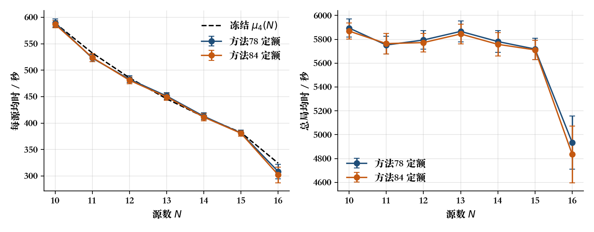

# Q4 分源数定额模拟

本节把第四问的源数钉在 $N=10,\ldots,16$，每档各跑 40 局，比较默认方法 78 与实验方法 84。它回答的是“各源数下本地控制器实际要花多久”，不是再估一条新的 $\mu_4(N)$，也不改变默认控制器。

## 1 设计（冻结后执行）

|项目|取值|
|---|---|
|问题|4|
|方法|78（默认）、84（对照，不晋升）|
|源数|10 到 16，每档 40 局，共 560 局|
|压力|0|
|种子|`2810001 + 1000*(N-10) + i`，`i=0..39`|
|生成|与 `make_case` 相同，但 $N$ 固定；原先 `10+rng()%7` 的那一次抽取不再消耗，因此这些环境不是独立集的子集|
|间距|源间距至少 40 m|
|定向源|`1+rng()%(N-1)` 个 180° 定向源，其余全向|

冻结参考曲线仍用先前独立集事后拟合、且已在种子 2710001–2710200 上验证过的

$$\mu_4(N)=-31.60+\frac{6206.85}{N}-\frac{513.96}{N}\mathbf{1}_{N=16}.$$

本套件不重估系数。本地模拟器、40 m 间距与官方加密日志不是同一分布；同一种子在不同编译器下也不保证同一场景。

复现：

```bash
python3 src/run_q4_by_count.py
python3 src/analyze_q4_by_count.py
```

## 2 正确性

560 局全部清完，账目与 `L/5+S+5M+3F+5N` 一致。$N<16$ 时发现停点数恒为 21；$N=16$ 才允许提前结束剩余发现，方法 78 平均 14.925 个发现点、跳过 6.075 步，方法 84 平均 14.525 个发现点、跳过 6.475 步。证书字段均为 `convex_mesh_per_channel`。

## 3 方法 78：各源数的时长

Student-$t$ 区间按每档 40 局、自由度 39 计算。$\tau=T/N$。

| $N$ | 总局均时 $T$/秒 | $T$ 的 95% 区间 | 每源 $\tau$/秒 | $\tau$ 的 95% 区间 | 冻结 $\mu_4$ | $\tau-\mu_4$ | 行走/秒 | 测向 | 发现点 | 失败清除 |
|---:|---:|---:|---:|---:|---:|---:|---:|---:|---:|---:|
|10|5894.5|[5817.5, 5971.4]|589.45|[581.75, 597.14]|589.09|+0.36|4141.3|281.5|21.00|9.43|
|11|5751.7|[5678.1, 5825.2]|522.88|[516.19, 529.57]|532.66|$-9.78$|4116.3|261.6|21.00|8.18|
|12|5793.9|[5715.6, 5872.2]|482.83|[476.30, 489.35]|485.64|$-2.81$|4206.6|250.2|21.00|13.20|
|13|5866.1|[5779.7, 5952.5]|451.24|[444.59, 457.88]|445.85|+5.39|4310.2|242.9|21.00|15.60|
|14|5780.9|[5689.1, 5872.7]|412.92|[406.37, 419.48]|411.75|+1.18|4332.5|225.0|21.00|14.03|
|15|5718.1|[5629.1, 5807.2]|381.21|[375.27, 387.15]|382.19|$-0.98$|4378.7|206.2|21.00|13.43|
|16|4934.0|[4709.8, 5158.3]|308.38|[294.36, 322.39]|324.21|$-15.83$|3803.2|167.5|14.93|18.13|

相邻档的每源均时差为 $66.57,40.05,31.59,38.32,31.71,72.83$ 秒，样本均值严格递减。这是条件均值的观测，不是每一固定几何布局的逐局单调性。

总局时在 $N=10$–$15$ 大致落在 $5720$–$5900$ 秒，并不随源数单调下降；到 $N=16$ 才因发现可提前停止而下降约 $784$ 秒。每源变便宜，主要是 21 点发现扫描和共同路程被更多源分摊，以及空频道减少，而不是单源定位本身变快。

冻结曲线在 $N=10,12,14,15$ 与定额均值相差不到 3 秒；$N=11$ 低 9.8 秒，$N=16$ 低 15.8 秒。七档单元格均值相对冻结曲线的 RMSE 约 7.4 秒。偏差可以来自：定额生成不再消耗“先抽 $N$”的随机数，因此与独立集不是同一场景族；以及 $N=16$ 的停止样本方差更大（总局区间宽约 448 秒）。

## 4 方法 84 对照（不晋升）

同一种子成对比较，正值表示 84 比 78 更短。

| $N$ | 84 每源/秒 | 84 总局/秒 | $T_{78}-T_{84}$ 均值 | 95% 区间 | 更快/更慢 |
|---:|---:|---:|---:|---:|---:|
|10|586.86|5868.6|+25.8|[$-16.4$, 68.1]|26 / 14|
|11|523.97|5763.7|$-12.0$|[$-53.2$, 29.2]|25 / 15|
|12|481.01|5772.2|+21.7|[$-17.2$, 60.7]|25 / 15|
|13|449.57|5844.4|+21.7|[$-26.2$, 69.7]|29 / 11|
|14|411.26|5757.6|+23.3|[$-31.2$, 77.8]|24 / 16|
|15|380.74|5711.1|+7.1|[$-34.0$, 48.1]|21 / 19|
|16|302.23|4835.6|+98.4|[$-56.5$, 253.3]|23 / 17|

七档区间都穿过 0。$N=16$ 点估计节省最大，但区间也最宽。单档 CPU：方法 78 约 $0.32$–$1.11$ 秒/局，方法 84 约 $1.37$–$2.25$ 秒/局。默认控制器仍是 78。

## 5 图



左图为每源均时及 95% $t$ 区间，虚线为冻结 $\mu_4(N)$；右图为总局均时。左图下降、右图在 $N<16$ 近似持平，与第 3 节的分解一致。

## 6 结论

1. 在钉死 $N$ 的第四问本地模拟里，默认方法 78 于 $N=10$–$16$ 全部清完；每源均时从 589 秒降到 308 秒，总局时则要到 $N=16$ 才明显下降。
2. 冻结的 $\mu_4(N)$ 仍可作为数量级参考，但本套件是新环境族，不作重新拟合，也不把单元格偏差写成对旧公式的证伪。
3. 方法 84 在各源数上没有可宣称的显著优势，保持实验状态。
