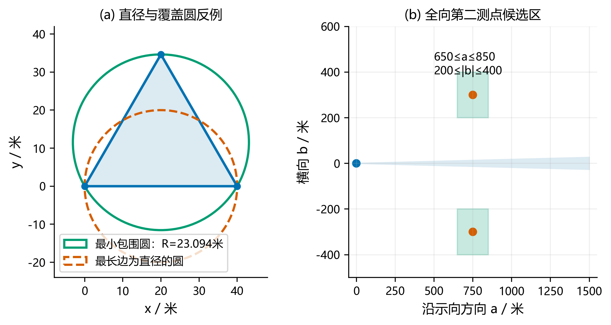
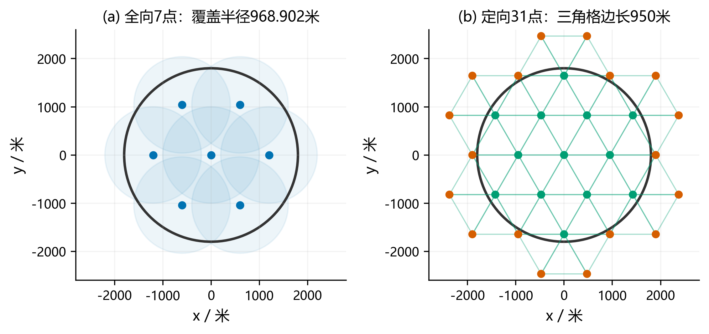
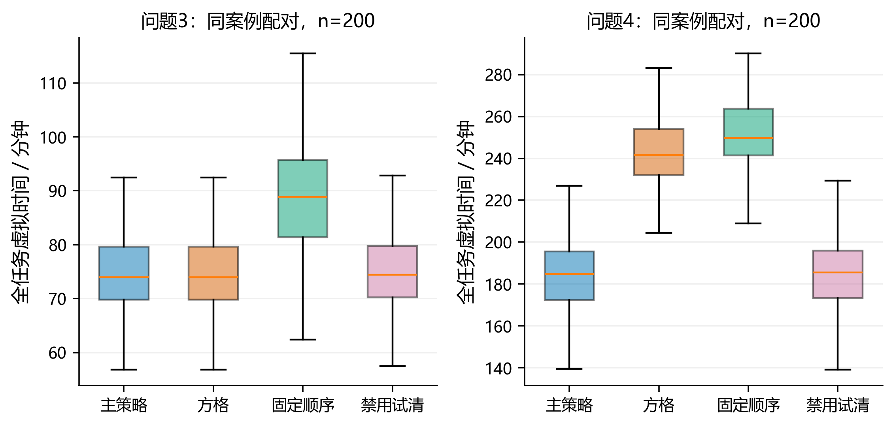
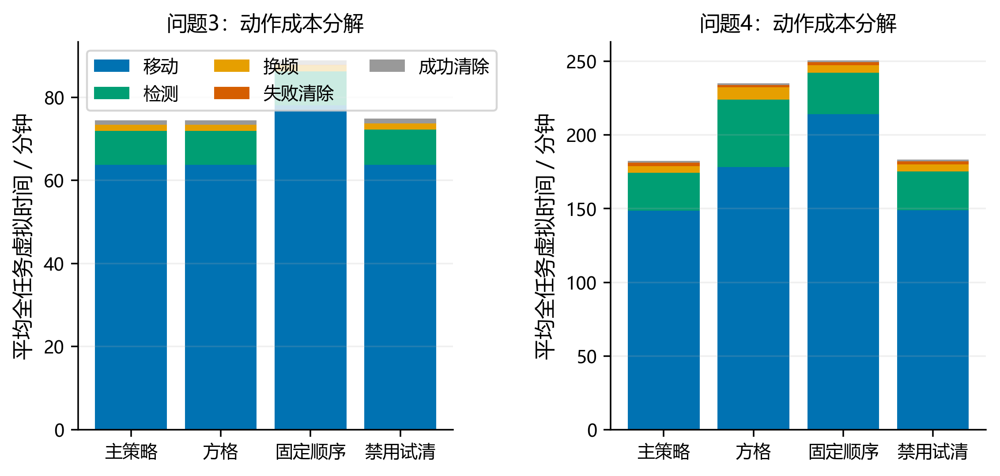
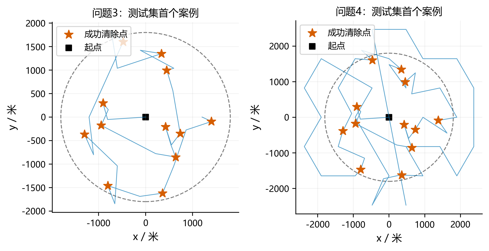

# 交接范围与可直接采用的摘要

本文件面向论文执笔人，正文模型、算法、数值结果和图表均已对应到可运行代码。实验数字由本机程序计算，语言模型负责方案设计、推导组织、解释、写作和独立审查。本文不是官方测试完成证明：现有 `26B-team-v1.0.0` 是队内模拟器，以下数值均标明来源；题目要求的每问三次官方正式测试及加密日志尚未取得。

**建议题名：基于有界误差几何与连续覆盖证书的无线电干扰源自动定位清除。**

**摘要（可用于论文改写）：** 针对干扰源数量未知、示向度含有界误差且定向辐射导致漏检的自动定位清除任务，建立以完整清除为约束、总虚拟时间为目标的分层闭环模型。首先将示向观测表示为前向角锥，利用半平面交获得凸定位区域，由顶点对计算直径、由最小包围圆判定能否保证单点清除；构造三组合法观测形成边长40米等边三角形的反例，其最小包围圆半径为23.094米，否定“直径不超过40米即可保证清除”的判据。其次在未知距离下给出第二测点的双矩形候选区，并证明考虑读数量化后最坏接收距离为950.709米，小于1000米最小接收半径。对全向源，以7个测点构造覆盖半径968.902米的逐频道排除证书；对混合源，以950米等边三角格的31个测点构造任意发射朝向的凸包覆盖证书，并用有限光学覆盖保证局部失联后的清除。采用最近邻调度和有界次数的提前试清，在每问200个独立本地随机案例中均实现全部清除，平均单源时间分别为349.87秒、868.17秒。相对固定访问顺序，两问平均总时间分别下降16.15%、27.23%；混合情形相对600米方格方案下降22.44%。五组共1000局压力测试，以及原模拟器60局物理核和6局HTTP演练均实现全部清除。上述几何保证不依赖误差独立性，实验性能仅对应已声明的本地分布，不代表官方隐藏案例成绩。

**关键词：** 有界误差；交会定位；最小包围圆；连续覆盖；主动检测；闭环搜索。

# 问题重述与统一目标

干扰源位于半径1800米圆域内，每个源占用互异的一个频道，频道来自1—20，源总数为10—16但不可通过机器人接口读取。机器狗从原点和频道1出发，以5米/秒沿直线移动；每次只能停下检测一个频道。检测返回无信号、距离过近或含误差的示向度，不提供距离、场强和源类型。

问题1要求根据若干测点及示向度求多边形定位区域直径，并判断同直径圆的覆盖能力。问题2只给一次全向源观测，需要在未知源距条件下选第二测点。问题3要求对全部全向源自动搜索、定位、清除并合理停止；问题4将未知朝向的180°定向源加入环境，必须重新设计漏检排除依据，而非仅替换定位公式。

记动作路径总长为 $L$，频道实际切换次数为 $N_s$，检测次数为 $N_m$，失败清除次数为 $N_f$，成功次数为 $N_c$。严格按附件计时，

$$
T=\frac{L}{5}+N_s+5N_m+3N_f+5N_c. \tag{1}
$$

`/clear` 的频道只标识目标，**不改变测向机频道**。未命中的3秒和命中的5秒均计入总时间；补漏扫描至取得停止证书的时间也包含在内。因而低平均时间不能以遗漏目标换取。

令 $\mathcal E$ 为满足题面约束的环境集合，$\pi$ 为基于历史观测的策略。理想任务可写为：在每个合法环境均有完整清除证书的策略类中，降低 $T(\pi,E)$。本文不声称求得全局时间最优策略，而构造有有限完成保证的策略，并在预声明本地分布 $\mathcal D$ 上比较 $\mathbb E_{E\sim\mathcal D}T$。全清除保证与平均效率证据分别由理论和实验支持。

# 假设、符号与参数来源

## 采用与不采用的假设

1. 源位置、频道、接收半径和发射方向在单局内固定；使用题面给定的二维、无遮挡直线运动规则，不增加机器狗动力学或障碍模型。
2. 每个源的接收半径 $R_k\in[1000,1500]$，这是接收能力边界，不是检测后源距的区间。正常示向仅说明距离 $5<r\le1500$ 且位于辐射覆盖内。
3. 物理示向误差满足 $|e|\le1^\circ$。同地点误差固定，不用原地重复平均缩小不确定性。算法的正确性不要求高斯、均匀或独立误差。
4. 接口保留两位小数。工程可行域使用 $\bar\varepsilon=1.005^\circ$，同时保留坐标双精度往返精度；几何理论问题1仍按题面 $1^\circ$ 推导。
5. 一次已接受的光学清除请求只由20米距离判定成败，不受源的辐射方向影响。接口真实响应可靠；断连、超时和拒绝响应按协议处理，不能当作“无信号”。
6. 仿真案例分布仅是实验假设，不参与完整清除证明。正常分布设置40米最小源间距是本地模拟器设计，策略不依赖它；额外使用重合与近距离压力案例验证这一点。

## 主要符号

|符号|含义|单位/范围|
|:--|:--|:--|
|$\Omega$|目标闭圆域，$\{z:\|z\|\le1800\}$|米|
|$z_k,R_k,n_k$|频道$k$的源位置、接收半径、发射单位方向|米、米、无量纲|
|$s_i,\theta_i$|第$i$个检测点与返回示向度|米、度|
|$u_i,v_i$|示向单位向量及其逆时针法向量|无量纲|
|$\varepsilon,\bar\varepsilon$|物理误差半角、含量化的工程半角|1°、1.005°|
|$W_i,P_k$|一次角锥、频道$k$的保守定位多边形|平面集合|
|$D(P),c(P),\rho(P)$|区域直径、最小包围圆圆心、半径|米|
|$a,b$|第二测点相对首次示向的纵、横偏移|米|
|$M_k$|频道$k$实际返回无信号的测点集|有限集合|
|$S,S_z$|覆盖测点集、其中距位置$z$不超过1000米的子集|有限集合|
|$h$|三角网格边长|950米|
|$\tau$|允许提前试清的包围圆半径阈值|35米|
|$L,T,N_m,N_s,N_f,N_c$|路长、时间与各动作计数|米、秒、次|
|$N_r,C_r,T_r$|案例$r$的源数、清除数、总虚拟时间|个、个、秒|

## 参数选择依据

物理常数全部来自题面及附件。7点的1200米外环半径、双矩形候选区和750±300米第二点继承参考思路，并经独立程序核验。64边外切圆多边形保证包含真实圆盘，径向最大外扩比例为 $\sec(\pi/64)-1$，目标圆域的最大外扩约2.171米，属于保守计算近似。

三角格比较900、950、990米；其中950与990米均需31点，950米具有50米接收裕量，开发集总时间也更小。提前试清阈值比较20、35、50米：35与50米的开发集表现接近，主策略保留35米，避免按微小样本差异继续追参。以上只在种子1—40的开发集决定；种子10001—10200只用于最终评估。局部主循环上限3轮、横移50米和兜底网格上限28米是公开的工程参数，前两项控制试探成本，后者由 $28\sqrt2/2<20$ 直接推出覆盖保证。

{{DEV_TABLE}}

# 问题1：交会区域、直径与正确清除判据

## 前向角锥与半平面交

对观测 $(s_i,\theta_i)$ 定义

$$
u_i=(\cos\theta_i,\sin\theta_i)^\top,\qquad
v_i=(-\sin\theta_i,\cos\theta_i)^\top.
$$

可能位置满足

$$
W_i=\{z:\ |v_i^\top(z-s_i)|\le\tan\varepsilon\,u_i^\top(z-s_i)\}. \tag{2}
$$

它等价于两个线性不等式

$$
(v_i-\tan\varepsilon\,u_i)^\top(z-s_i)\le0,\qquad
(-v_i-\tan\varepsilon\,u_i)^\top(z-s_i)\le0. \tag{3}
$$

相加可得 $u_i^\top(z-s_i)\ge0$，因此这是真正的前向角锥，不会将检测点背后纳入。用向量形式直接处理跨越0°的读数，无需对角度区间作易错的分支。纯交会区域为 $P=\cap_iW_i$。

**算法1（可靠枚举版）。** 将全部约束记为 $a_j^\top z\le b_j$，枚举不平行边界交点，保留满足全部约束的点；辅助检测原点和原点在每条边界上的投影，用于平行条带等无顶点可行域。若无可行点则为空集。若可行，再判断衰退锥 $\{d:a_j^\top d\le0\}$ 是否存在非零向量；可枚举边界方向及坐标轴方向，若存在则区域无界，直径无穷。若有界，则对可行交点取凸包并计算顶点对最大距离。该版本复杂度为 $O(n^3+m^2)$，观测数较少时透明、便于独立核验。空集返回“不一致观测”；线段、单点分别返回端点距离和0。

该算法不靠任意大矩形截断无界集合。与问题3/4中的已知目标圆域不同，问题1仅讨论纯角锥交集时，应保留“无界”的真实答案。上述分类在精确算术下成立；当衰退方向仅因容差放宽才被接受时，浮点实现返回numerically_uncertain诊断，须用高精度或精确谓词继续处理，不将这种近退化情况误报为无界。该诊断函数用于问题1核验，在线策略以已知有界目标域裁剪，未调用此无界分类函数。

## 直径必由顶点对取得

设 $P$ 的顶点为 $p_1,\ldots,p_m$。对任意 $x=\sum_i\lambda_i p_i$、$y=\sum_j\mu_jp_j$，其中系数非负且各自和为1，有

$$
\|x-y\|=\left\|\sum_{i,j}\lambda_i\mu_j(p_i-p_j)\right\|
\le\sum_{i,j}\lambda_i\mu_j\|p_i-p_j\|
\le\max_{i,j}\|p_i-p_j\|.
$$

顶点本身属于 $P$，故

$$D(P)=\max_{i,j}\|p_i-p_j\|. \tag{4}$$

已排序凸多边形可用旋转卡壳将此步降至线性时间，本文实现采用二次枚举，避免小规模问题中复杂分支带来的验证负担。

## 真实观测反例与最小包围圆

取三个检测点和读数：

$$
s_1=(-1000,0),\quad s_2=(540,-500\sqrt3),\quad
s_3=(520,520\sqrt3),\qquad \theta=(1^\circ,121^\circ,241^\circ).
$$

以 $1^\circ$ 半角构成的角锥交集恰好是顶点 $(0,0),(40,0),(20,20\sqrt3)$ 的等边三角形。选择真实源 $z=(20,20\sqrt3/3)$，三个读数误差均为约 $+0.351405^\circ$，源距均约1020.065米；取接收半径不小于此值即是题面允许的真实场景。独立脚本枚举六条边界并验证了整个交集，而非只绘制一个抽象三角形。

该三角形直径为40米，最小包围圆半径却是 $40/\sqrt3=23.094011$ 米。因此无论怎样选圆心，半径20米的圆都不能覆盖它，问题1的回答是**一般不能**。

后续使用

$$
\rho(P)=\min_c\max_{z\in P}\|z-c\|,
\qquad \rho(P)\le20 \Longrightarrow \text{在 }c(P)\text{清除必成功}. \tag{5}
$$

因欧氏球为凸集，覆盖全部顶点就覆盖整个凸多边形。最小包围圆由至多三个边界支持点决定，可以采用增量算法；Welzl给出了随机增量算法的期望线性时间结果[4]，CGAL也给出了该对象的精确定义[5]。本文实现是小规模确定顺序增量版本，保守按三重循环计复杂度，不将随机算法的期望复杂度直接套用。

{width=100%}

# 问题2：未知距离下的第二测点设计

## 先满足最坏接收约束

设首点为 $s$，读数对应单位向量 $u,v$，真实源写为

$$z=s+r(\cos\phi\,u+\sin\phi\,v),\quad 5<r\le1500,\quad |\phi|\le\bar\varepsilon. \tag{6}$$

若不假设源距先验，最大化“名义90°交会角”无法直接给出可靠测点。对 $q=s+au+bv$，先要求其到所有可能源的距离不超过1000米，再讨论定位质量。一个可计算的充分候选区为

$$\mathcal C=\{s+au+bv:650\le a\le850,\quad200\le|b|\le400\}. \tag{7}$$

记 $B=|b|$。距离平方为

$$f=r^2+a^2+b^2-2r(a\cos\phi+b\sin\phi).$$

对 $r,a,B$ 分别固定其余变量时函数为凸函数，最大值可归约到区间端点；由于 $\phi$ 仅在±1.005°内，且 $B\cos\bar\varepsilon>a\sin\bar\varepsilon$，角度最坏端点与 $b$ 异号。枚举这些有限端点得到

$$
\max f=1500^2+650^2+400^2-3000(650\cos\bar\varepsilon-400\sin\bar\varepsilon),
$$

$$\max\|q-z\|=950.708979<1000. \tag{8}$$

取开区间 $r>5$ 的闭包求上界不会削弱保证。故候选区每一点均可接收全向源，无须知道实际 $R_k$。另外，首视线与第二点之间的垂距至少为 $200\cos\bar\varepsilon-850\sin\bar\varepsilon>185$ 米，远大于5米，因此不会在此候选区出现近距离饱和；两条真实视线的交会角满足 $|\sin\alpha|>185/950.709$，排除了严格共线退化。

## 精度目标及可复现实用选择

可将第二点的纯定位质量写为最坏后验包围半径：

$$
q^\star\in\arg\min_{q\in\mathcal C}\sup_{\theta\in\Theta(q)}
\rho\big(P_1\cap W(q,\theta)\big), \tag{9}
$$

其中 $\Theta(q)$ 包含首次信息下所有可能第二读数。实际运行可加上移动成本及后续动作的代价，形成精度—路程折中。本文不假定式(9)已被连续全局求解，而做确定性离散评分：源距取25、50、…、1500米，首角偏差与第二误差各取 $-1.005^\circ,0,1.005^\circ$，逐一重新计算保守多边形及包围圆。下表中的“最坏”仅是这些离散场景的最大值，不能替代连续上确界。

{{Q2_TABLE}}

非共线候选均包含540个几何场景；表内共线候选 $(750,0)$ 排除与源距离不超过5米的3个饱和场景后为537个。因此其均值仅作退化现象说明，不作为严格同样本统计检验。

共线候选 $b=0$ 明显保留数百米的不确定性。横向偏移增加能降低本组场景的包围半径，但也增加移动；因此任务策略采用对称且较短的 $q=s+750u\pm300v$，按当前位置选择较近的一侧，而不是声称这一点为精度最优点。若只以本文离散几何评分为目标，则表内最佳值出现在 $(850,400)$。该区别使问题2的“较好定位”与问题3的“较短完成时间”保持一致而不混同。

# 问题3：全向覆盖、逐频道状态机与闭环清除

## 保守位置更新

对每个已发现频道保存

$$
P_k=\Omega^{\rm out}_{64}\cap\bigcap_{i\in I_k}
\left[W_i(\bar\varepsilon)\cap B_{64}^{\rm out}(s_i,1500)
\cap\{z:u_i^\top(z-s_i)\le1500\}\right]. \tag{10}
$$

上标out表示外切正64边形。圆盘与角锥均包含真实位置，附加轴向上界也由真实距离不超过1500米推出；归纳可知每次更新后 $z_k\in P_k$。即使误差完全相关或恒取端点，该包含关系仍成立。工程版本不使用 $r>5$ 的内孔，也不精确保存失败清除后的非凸孔洞，这会牺牲部分效率，但不会错误排除真实位置。

## 七点连续覆盖证书

取

$$S=\{(0,0)\}\cup\{1200(\cos(j\pi/3),\sin(j\pi/3)):j=0,\ldots,5\}. \tag{11}$$

对极径 $r$ 的任意源，最近外环点与其极角差不超过30°，因此最近测点距离平方不超过

$$\min\{r^2,r^2+1200^2-2400r\cos30^\circ\}.$$

两项相交于 $r_0=1200/\sqrt3$。在 $[0,r_0]$ 使用原点，在 $[r_0,1800]$ 使用外环点；后一二次式为凸函数，只需检查端点。得到全圆域覆盖半径

$$\sqrt{1800^2+1200^2-2\cdot1800\cdot1200\cos30^\circ}=968.901572<1000. \tag{12}$$

每个尚未发现的全向频道在测点 $s$ 返回无信号，可排除闭盘 $B(s,1000)$。若对该频道实际完成七点扫描且均无信号，式(12)给出该频道不存在源的证书。定位中先发现的频道无需继续参与全局扫描，其存在性已确定，转入局部完成流程。

## 调度与局部定位算法

每个频道维护“未发现、已发现待清除、已清除”，未发现频道在覆盖流程完成时转为“已证不存在”。每轮选择距离当前机器狗最近的未访问覆盖点，停车后从当前接收频道开始循环检查所有未发现频道。同一地点收集完发现信息，再按定位区域包围圆圆心距当前位置的最近邻顺序处理待清除源。各频道互异，清除后立即退出后续检测队列。

**算法2（局部定位）。**

1. 若返回near，立即原地清除，成功是由5米阈值推出的必然事件。
2. 若只存在一次正常示向，按式(7)的固定点取得第二观测。更新式(10)。在问题4中若无信号，可试另一侧；两侧均失败则准备光学兜底。
3. 计算 $(c,\rho)$。若 $\rho\le20$，在圆心清除有几何保证；若 $20<\rho\le35$，每轮至多允许一次经济性试清，3轮合计至多3次。失败不能标记已清除，也不能据此宣称定位错误。
4. 尚未成功时在当前包围圆圆心检测。若它与当前位置距离小于1米，则沿首次示向法线横移50米，避免同地重测；失联时还可尝试圆心的一个50米横移点。
5. 上述主循环最多3轮，未完成则对当前保守区域的外接矩形作有限光学覆盖，直至成功。循环上限是真正的终止保证组成部分。

提前清除是可检验的启发式：已确定存在的源可能位于圆心20米内，失败成本仅3秒；但 $\rho>20$ 时绝不将该动作写作“保证成功”。主策略在测试集中失败清除次数由日志真实计入，消融单独评估该机制的收益。

整体输入输出及状态转移可概括为：

```text
输入：题号、物理常数、measure/clear响应；不输入案例真值。
初始化：20频道未发现，当前位置原点、接收频道1，覆盖点均未访问。
循环：选择最近的未访问覆盖点；逐一检测未发现频道。
      direction → 保存/更新保守P；near → 同点clear。
      从已发现未清除频道选最近候选；调用有界局部定位与光学兜底。
      success → 标记已清除；累计16个success可正常退出。
全部覆盖完成且无待清除频道 → 输出逐频道完整性证书并exit。
拒绝、超时或几何异常 → 报告未完成；不生成全清除证书。
```

## 停止与完整性

只允许两个正常停止条件：其一，已成功清除16个互异频道，达到题目上界；其二，所有覆盖点的必要频道扫描完成，且所有发现源已成功清除。第二个条件同时给每个频道“已清除”或“不存在”证书。仅清除10个、最近几次没有新发现、走完部分路线均不能退出。

对任意合法全向源，若尚未发现，完整七点扫描中至少一个位置必定接收；发现后有限光学覆盖必然清除。因此在通信正常且现实预算足够完成有限动作的条件下，两种正常停止条件都蕴含全清除。程序在网络异常、几何集合意外为空或预算不足时报告未完成，不会把异常退出当作证明。

# 问题4：任意发射朝向的覆盖与失联兜底

## 为什么必须改变覆盖结构

当存在定向源时，no_signal既可能来自超距，也可能来自背面。故不能直接删除测点周围1000米的位置候选区。更强的反例是圆周上朝外辐射的源：除与源重合外，所有严格圆内测点都在发射背面；只在目标圆域内部加密无法给出一般发现保证。

本文不试图精确恢复源朝向，而设计满足全部可能朝向的覆盖测点。源一旦给出正示向，其位置仍可用问题1的角锥更新；负观测在局部阶段只作操作反馈，不用于错误的位置排除。

## 凸包覆盖定理

对任意位置 $z$ 定义 $S_z=\{s\in S:\|s-z\|\le1000\}$。若

$$z\in\operatorname{conv}(S_z), \tag{13}$$

则无论发射单位方向 $n$ 如何，都存在 $s\in S_z$ 满足 $n^\top(s-z)\ge0$，因而可接收定向信号。证明：将 $z$ 表为测点的凸组合，若所有点积均严格为负，则加权和既等于0又小于0，矛盾。定理依赖题面将±90°边界计入有效辐射区。

于是取等边三角格

$$s_{ij}=h(i+j/2,\sqrt3j/2),\quad i,j\in\mathbb Z,\quad h=950,$$

保留所有与目标闭圆域相交的闭三角形的全部三个顶点。每个源所在三角形的三个顶点距源均不超过边长950米，而且源属于三点凸包，故式(13)成立。单元相交通过“原点到三角形最短距离不超过1800”判断，包含相切单元；不能只根据单元中心是否在圆内筛选。

独立枚举得到31个测点，最远测点半径2513.464米，允许位于目标圆域外。600米方格的对应构造需要61点。点数减少49.18%仅是布局复杂度比较，实际时间收益必须由同案例仿真给出。

{width=100%}

## 失联后的连续光学覆盖

沿用问题2的两侧测点并不保证定向接收：源位于 $(50,0)$ 且向负x轴发射时，原点有信号，$(750,\pm300)$ 都在背面。因此局部算法设置有限试探次数后，执行与朝向无关的光学覆盖。

在首次示向的局部坐标中，由式(10)有

$$0\le x\le1500,\qquad |y|\le1500\tan(1.005^\circ). \tag{14}$$

对当前 $P_k$ 求这组坐标下的外接矩形，将两边分别等分为 $n_x=\max(1,\lceil\Delta x/28\rceil)$、$n_y=\max(1,\lceil\Delta y/28\rceil)$ 份，在每个子矩形中心试清。每格边长不大于28米，格内任一点距中心不大于 $14\sqrt2=19.799$ 米。因此清除圆盘覆盖完整连续可行域，不依赖有限粒子的代表性。式(14)给出 $n_x\le54,n_y\le2$，所以最坏108次清除请求内必定命中。按列蛇形访问并从较近端出发，控制路径长度。

独立数学预审另给出了100次清除的更紧固定构造，但**本次交付实现使用108次上界的28米网格**，论文性能和终止证明以真实实现为准。当前多次交会得到的矩形一般远小于式(14)，实际清除次数由每局数据统计。

{{BOUND_TEXT}}

上述完整性是有限动作层面的几何结论。官方现实预算还依赖HTTP响应延迟和是否提前进入测试窗口；不能把虚拟时间上界当成20分钟现实运行保证。接口桥以enter返回的实际剩余时间设定截止，未取得正常停止证书就应标注本局未完成。

# 实验设计、验证与结果

## 三层证据与盲测边界

**第一层：C++规则模拟。** 使用固定种子产生案例，模型策略通过只含measure/clear的抽象接口接收响应。策略不链接真值生成逻辑；评估器可在每次正观测更新后单独检查真实位置是否仍在多边形内，这个检查不返回决策信息。逐局核对式(1)、完整清除数和终止证书。案例数在10—16均匀取值，频道不放回抽样，位置按圆域面积均匀分布，接收半径均匀分布于1000—1500米；问题4定向数在1—$N-1$之间，朝向均匀。正常误差由位置厘米网格和种子哈希生成，同地点固定；它与官方及原Python模拟器的误差实现不相同。

**第二层：原Python物理核。** 将同一个C++机器人作为独立子进程，通过管道接到已有模拟器的Session，使用种子20001—20030，每问30局。无需复制其哈希或场景随机数实现，直接验证在独立物理实现上的完整清除。

**第三层：原模拟器HTTP演练。** 每问使用30001、30002、30003三个固定种子，经过真实本地HTTP请求、幂等ID和JSON序列化，保存明文逐动作日志。均为本地practice模式，不占用也不伪装官方正式次数。原模拟器自带的协议一致性测试98项通过；该测试的合法性不能反推官方实现与本地完全相同。

算法开发集为每问40局。冻结参数后，独立随机评估为每问200局；三种消融与主策略使用相同源环境、固定位置误差场和种子配对，动作路径不同产生的不同位置读数正是闭环策略差异。独立测试集不用于再次选参。

## 指标及统计方法

每局清除比例 $C_r/N_r$、每局单源时间 $A_r=T_r/C_r$ 按题目定义。下表平均单源时间是 $\bar A=\frac1n\sum_rA_r$，即各案例等权；它一般不等于 $\sum_rT_r/\sum_rC_r$，聚合口径不能混用。所有试验全部清除，因此没有通过只计成功案例隐藏失败。

时间均值区间使用独立案例上的Student-t区间，配对消融区间则对 $\Delta_r=T_{\rm baseline,r}-T_{\rm main,r}$ 构造。源在同一局中共享路径，不将每个源当作独立统计样本。200/200局成功的双侧95% Clopper–Pearson区间下限约98.17%，说明有限成功样本本身不能证明所有环境成功；普适性由前述覆盖与有限兜底证明支持，统计区间仅描述本地分布。

{{MAIN_TABLE}}

## 消融与效率来源

固定访问顺序消融保留同样的几何定位与覆盖点，只将最近邻选覆盖点及待定位频道排序替换为固定索引顺序；所以其差异体现调度机制，而非换用更弱清除保证。方格消融只针对问题4改变覆盖网格。禁用提前试清把阈值35米改为20米，仍保留最终光学网格兜底；因此问题4中仍可能出现兜底产生的失败清除，不能把该消融误写为“零失败尝试”。

{{ABLATION_TABLE}}

主策略相对方格在问题4的平均总时间下降22.44%，200个案例中190个更快；它不是逐案例支配，也不是全局最优。最近邻调度在问题3和4分别降低16.15%、27.23%，是本实验最明确的效率来源。提前试清仅贡献约0.44%、0.50%的总时间下降，虽配对区间为正，实际收益较小，论文不应将其包装成核心创新。

{width=100%}

{{COST_TEXT}}

{width=100%}

## 压力测试与跨实现核验

压力组均每问100局：圆周向外发射且接收半径1000米、近共线位置且负端点误差、空间平滑相关误差、按位置固定正负端点误差，以及源重合/5米/20米近距离布局。问题4各组仍至少保留一个全向源和一个定向源。前两组及近距离组不服从正常随机分布，用于检验边界规则与误差相关性。结果如下，不能将压力组混入独立正常分布的均值区间。

{{STRESS_TABLE}}

{{MOCK_TABLE}}

```{=latex}
\clearpage
```

{width=100%}

程序运行时间分三个口径：C++内循环计时仅包括策略、规则响应和验证，不包括案例生成及进程启动；原物理核子进程时间包含管道与进程成本；HTTP演练时间从发送enter前开始到exit响应，包含通信。官方表格必须使用官方记录的运行时间，不能用其中任意本地口径替代。

# 代码对应、复现与正式测试交接

## 代码与论文的对应关系

|文件|职责|对应内容|
|:--|:--|:--|
|`src/geometry.hpp`|半平面交、凸包、直径、最小包围圆、外切圆与覆盖网格|问题1、问题2、式(10)—(13)|
|`src/q2_design.cpp`|确定性第二点几何评分|问题2表格|
|`src/policy.hpp`|只访问观测的状态机、调度、局部定位、有限光学覆盖|问题3、问题4|
|`src/robot.cpp`|C++策略独立进程，仅通过管道接收响应|接口部署|
|`src/bridge.py`|串行HTTP、同ID重试、JSON、日志、现实截止|附件2实现|
|`src/simulator.hpp`|本地案例及规则物理、独立计数和包含检查|第一层实验|
|`src/experiment.cpp`|固定种子批量实验与逐局CSV|主结果与消融|
|`src/validate_mock.py`|原Python物理核及真实HTTP演练|第二、三层核验|
|`src/report.py`|统计、置信区间和可复现绘图|所有结果图表|
|`review/check_geometry.py`|独立几何构造与常数验证|数学预审|

原模拟器未修改。C++策略没有debug/truth请求、隐藏源数、真实半径或发射朝向输入。真值仅存在于模拟层和独立验证层，并不影响选点。

## 一键复现实验

在成果目录运行 `powershell -ExecutionPolicy Bypass -File .\run_all.ps1`。需要已有g++、Python及numpy/scipy/matplotlib；HTTP桥仅依赖Python标准库和上级目录的原模拟器。脚本先编译与执行边界测试，再重跑开发/冻结测试/压力/原模拟器核验，最后更新统计及图。结果CSV数值应复现，墙钟运行时间会随机器负载变化。

`results/summary.json` 是正文数字来源；逐局CSV保留全部测试种子、动作计数、路程、虚拟时间、计算时间和证书。`results/LOCAL_HTTP_*.jsonl` 是本地明文日志，不应冒充官方加密日志。图同时提供PNG、SVG、PDF，执笔人应优先插入矢量PDF或SVG；缩放后确保图中文字仍可辨认。

## 官方正式测试待办与表格状态

题面要求问题3与问题4各三次正式测试。当前没有官方登录会话、案例编码或导出加密日志，故六条正式记录均未执行。本地能够自主完成的建模、演练与接口准备已经完成；真实正式结果只能在官方模拟器准备就绪后取得。

|题号|正式序号|案例编码|清除数|平均时间|官方程序时间|加密日志|
|:--|:--|:--|:--|:--|:--|:--|
|3|1|未执行|未取得|未取得|未取得|未导出|
|3|2|未执行|未取得|未取得|未取得|未导出|
|3|3|未执行|未取得|未取得|未取得|未导出|
|4|1|未执行|未取得|未取得|未取得|未导出|
|4|2|未执行|未取得|未取得|未取得|未导出|
|4|3|未执行|未取得|未取得|未取得|未导出|

使用步骤：先在官方程序登录并进行演练，界面提示接口就绪后运行 `python src/bridge.py --problem 3 --team-id 实际队号 --log results/official_practice_p3.jsonl`；问题4改为4。进入正式模式由官方界面控制，桥程序本身不启动正式测试。每次日志路径必须新建，以防覆盖。完成正式测试后按官方界面抄录案例编码、清除数、平均时间和运行时间，导出原名加密日志并保留；本地明文日志只作辅助核对。

正式环境不返回真值总数，不得自行估计分母后填写“真实清除比例”。完整性可结合程序证书解释，但正式表格必须照官方输出填写。题面给出的启动截止与建议提前时点应以提供的官方材料及当时界面为准；本交接未联网操作正式会话。

# 独立审查、局限与写作建议

## 已实施的审查

数学预审由独立agent构造真实交会反例、核验候选区连续极值、七点覆盖、三角格与有限光学覆盖。实现reviewer另行检查几何、计时、通信和真值隔离；发现的截止重试问题和坐标序列化微米偏差问题均进入修复与回归，而不是仅以随机成功率替代审查。

{{REVIEW_TEXT}}

## 模型边界

第一，未求全局最短路或最优信息采样策略，最近邻也无本文场景下的最优性比界；本成果提供可复现的有效改进。第二，局部无信号和失败清除信息没有全部转化为非凸可行域约束，混合源仍存在保守光学扫描和较长补漏成本。第三，三角网格31点并非测点数量下界，平移网格、非规则覆盖与自适应证书可能继续优化。第四，只有在通信正常且现实预算足够的条件下，有限动作几何证明才能转化为实际全清除；本地HTTP延迟不能代表所有官方运行情况。第五，正常模拟分布、误差哈希和最小间距都不是官方隐藏分布，全部本地成功不能表述为“官方通过率100%”。

论文写作应将问题1的错误直径判据、问题2的保证接收区域、问题3的未知源数停止依据以及问题4的任意朝向覆盖四点串联。最强结果是“可验证不漏检机制＋同案例效率改进”，无需堆叠强化学习或复杂规划名词。每条改进均应与消融、每条保证均应与证明、每个数字均应与结果文件对应。

## 人工核验与AI使用记录

本次AI参与包括模型方案提出、公式推导整理、C++及桥接代码编写、结果解释、交接文档写作和独立agent评审。所有案例生成、几何常数、统计、仿真及绘图均由本机程序计算，未使用语言模型估计固定数值。不同agent属于独立任务上下文的模拟审查，不等于独立人类审稿或竞赛官方评分。参赛队应逐项核验核心模型、计算口径和正式测试记录，并根据实际提交要求完成真实的AI工具使用披露；本文件不虚构人工签核或工具使用历史。

# 参考资料与证据索引

[1] 2026年高教社杯全国大学生数学建模竞赛，B题《无线电干扰源的快速自动定位与清除》，本地原始文件 `B题/B题.pdf`，题面及附录1—4。

[2] B题附件1《模拟器使用说明》，本地原始文件 `B题/附件/附件1.docx`。动作计费和测试流程。

[3] B题附件2《模拟器通信接口说明及编程指南》，本地原始文件 `B题/附件/附件2.docx`。字段、读数量化、串行请求、幂等和期限规则。

[4] Welzl, E. Smallest enclosing disks (balls and ellipsoids). New Results and New Trends in Computer Science, LNCS 555, 1991: 359–370. DOI: [10.1007/BFb0038202](https://doi.org/10.1007/BFb0038202)。经出版方元数据与[作者主页](https://people.inf.ethz.ch/emo/MiscellaneousPubl.html)核对；仅用于最小包围圆算法背景。

[5] CGAL. [Min_circle_2 class reference](https://doc.cgal.org/latest/Bounding_volumes/classCGAL_1_1Min__circle__2.html). 查阅日期：2026-09-11。用于最小包围圆定义与支持点说明；本代码未调用CGAL。

[6] 队内模拟器 `26B-team-v1.0.0/README.md` 及 `mocksim/arena.py`。本地可执行规则与未由官方规定的随机分布声明。

[7] 用户提供 `6pro的思考.md`。作为建模建议来源；其几何结论经独立脚本重算，本文新增三角网格比较、可执行C++策略、分层实验及审查闭环，不将参考思路中的未运行结果当作本次实验。
