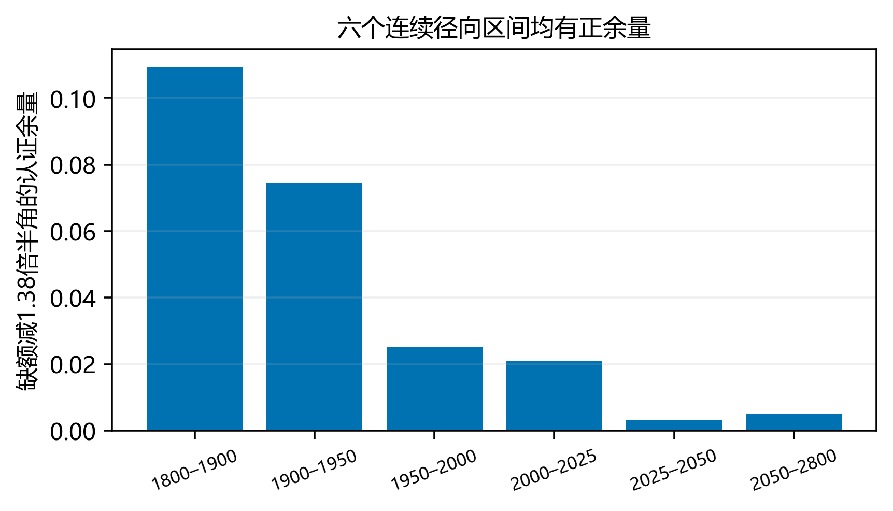
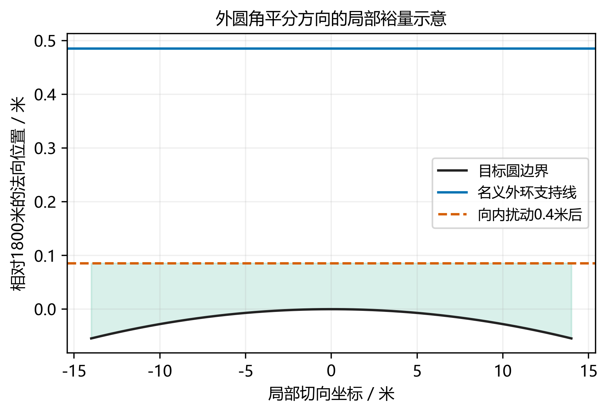
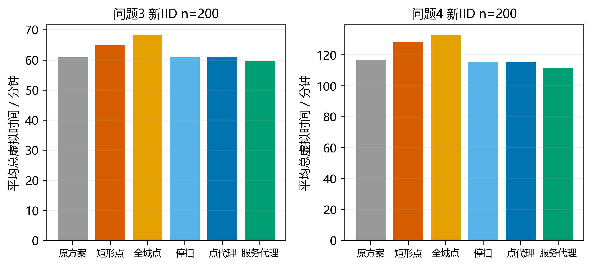

# 本轮结论

本轮强化四个部分：固定通用测点数下界由14提高为15；原21点获得正方向裕量和0.4米任意独立坐标扰动保证；将Q2两个理论候选真正放入在线控制器做同案例时间消融；将路径层扩展为带入口—出口路程估计、精确小规模求解与可计算上下界的代理模型。前三轮冻结成果保持不变，问题1、完整首扇区Q2证书和原始协议假设继续适用。

结果并非四项都获得新最优性：约106秒的有界探索没有找到18—20点连续认证布局，故点数界为$15\le N_{\mathrm{opt}}\le21$；正裕量是在原布局上用更细证书证明，不是重新移动测点。Q2全域点降低最坏定位半径，却使新测试集的任务均时增加，因此没有部署为默认测站。新的服务路程代理控制器在两问的IID总时间较第三轮分别下降约1.96%和4.51%，但它仍不是未知未来观测下的全任务最优策略。

本文用于替换上一版的下界、鲁棒性与调度实验说明。全部数值来自本地程序，证书、源码、逐局数据和独立审稿一并提供。六次官方正式成绩和原名加密日志仍未取得，不能由内部评分替代。

# 固定通用测点数下界提高到15

记目标圆半径$R=1800$、最小接收半径$L=1000$，$S$为要求覆盖所有位置及所有闭180°发射方向的有限固定测点集。对几乎所有源位置，至少需要三个$L$内近邻；少于三个只能在有限测点或两点连线的零面积集合上使源位于近邻凸包。因此

$$\sum_{s\in S}A(s)\ge3\pi R^2,\qquad A(s)=|\Omega\cap\overline B(s,L)|.$$

对圆周上向外发射的源，半径$r$的外部测点所能覆盖的圆周半角为

$$\delta(r)=\arccos\max\left\{\frac Rr,\frac{r^2+R^2-L^2}{2Rr}\right\},\quad R<r<R+L.$$

其余半径的有效弧长为零，有限单点不影响弧长条件，故$\sum_{\|s\|\ge R}\delta(\|s\|)\ge\pi$。定义该测点的面积缺额比例$d(r)=1-A(r)/(\pi L^2)$。本轮不再只使用“至少7个外点、各损失半个盘”的粗界，而认证连续关系

$$d(r)\ge1.38\delta(r),\quad R\le r\le R+L.$$

对$r\ge R$，两盘交面积可写为

$$A(r)=2\int_0^{1000}\left[\sqrt{1800^2-y^2}+\sqrt{1000^2-y^2}-r\right]_+dy.$$

被积函数随$y,r$不增，1米步长的左端矩形和给出积分上界。程序以整数平方根向上包住根号，使用有理数求和，并用余弦泰勒余项认证半角上界。六个径向区间连续覆盖1800—2800米，全部具有严格正余量；这里的端点用于构造整个区间的界，不是将采样当证明。

|外部半径区间米|缺额下界|半角上界弧度|耦合余量下界|
|:--|:--|:--|:--|
|[1800, 1900]|0.5590944|163/500|0.1092144|
|[1900, 1950]|0.6194313|79/200|0.0743313|
|[1950, 2000]|0.6488793|113/250|0.0251193|
|[2000, 2025]|0.6777744|119/250|0.0208944|
|[2025, 2050]|0.6919971|4991/10000|0.0032391|
|[2050, 2800]|0.7060609|127/250|0.0050209|

内部测点$d\ge0$，因此

$$3\pi R^2\le\pi L^2\left(N-\sum_s d(\|s\|)\right)\le\pi L^2(N-1.38\pi),$$

$$N\ge9.72+1.38\pi>14.05539\quad\Longrightarrow\quad N\ge15.$$

该下界针对固定有限通用无线电测点集，不是自适应或光学搜索的动作数下界。本轮在18、19、20点与外圈10、11、12点组成的九个变半径族中作有界搜索；粗网格曾产生看似优秀的20点候选，加密后暴露窄缺口，最佳修正候选的诊断半径为1024.61米，连续认证返回UNKNOWN。未找到不等于不存在，保留$15\le N_{\mathrm{opt}}\le21$，不宣称点数最优已闭合。

{width=100%}

# 原21点布局的正方向裕量

## 零证书裕量与布局本身不同

上一版粗分割的最小凸包支持裕量为0，只能说明那份证书没有正裕量，不能据此判断布局本身不鲁棒。本轮保持21个binary64坐标完全不变，要求每个叶单元不仅属于安全测点凸包，还至少离每条支持线$\eta$米，未满足的单元继续细分。

令$K_\tau=\operatorname{conv}(S_\tau)$。对其逆时针边$a\to b$和叶顶点$v$，精确验证

$$c=\operatorname{cross}(b-a,v-a)>0,\qquad c^2\ge\eta^2\|b-a\|^2.$$

线性支持不等式保证对全部$z\in\tau$均有$B(z,\eta)\subseteq K_\tau$。若每个测点独立变化为$s'=s+\Delta_s$，$\|\Delta_s\|\le\eta$，则对任意单位方向$u$，

$$h_{K_\tau'}(u)\ge h_{K_\tau}(u)-\eta\ge u^\top z.$$

因此$z\in K_\tau'$。同时，若未扰动点距整个单元不超过$r_c$，则$\|s'-z\|\le r_c+\eta$。取$\eta=0.4$、$r_c=999.6$，扰动后仍在1000米内，凸包条件继续覆盖任意发射朝向。

证书包含21996个叶单元，实际最小支持线裕量约0.458878566米，所有接受条件以精确有理数比较。另一份不导入生成器的检查程序以二进制前缀及Kraft等式重验分割覆盖，再独立验证所有半平面和距离条件。缺叶、夸大扰动半径的篡改证书会被拒绝。

故原布局可承受**每个全局测点独立、任意方向、欧氏距离不超过0.4米**的误差。由整体凸包最紧外边至目标圆的余量，还可给该固定布局的必要上限约0.485740203米。因此其可容忍扰动半径已限定在$[0.4,0.485740203]$米内；这个上限不属于所有21点布局的通用上限。

{width=100%}

## 未知位置误差也必须传播到局部定位

全局覆盖稳健不意味着用错误站址构建的局部角锥自动正确。为此新增可选工程模式：每条检测/清除命令的实际位置$s'$与报告或命令位置$s$满足$\|s'-s\|\le\eta\le0.4$，允许不同命令的误差不同。这个附加模型不是题面新增规则；正式接口默认仍取$\eta=0$。

若测向角锥半平面写为$n^\top(z-s')\le0$，则保守更新应使用

$$n^\top(z-s)\le\eta\|n\|.$$

接收距离上界放宽为$\|z-s\|\le1500+\eta$，同时保留有效的前向及横向界：

$$-\eta\le u^\top(z-s)\le1500+\eta,\qquad |v^\top(z-s)|\le1500\sin(1.005^\circ)+\eta.$$

near响应后原地发清除命令，真实源至新实际点最多为$5+2\eta<20$米。普通最小包围圆的保证清除阈值改为$\rho\le20-\eta$；半径35米仍只表示允许试清，不是保证成功。

光学网格边长取

$$g=\min\{28,\sqrt2(20-\eta)-10^{-6}\},$$

使任意子格点距名义中心加最坏清除站址误差仍小于20米。$\eta=0.4$时，首次外接框最大尺寸1500.8×53.418979米，最多55×2=110个光学中心，不能沿用108次上界。

鲁棒模式的名义长段仍至多213段，名义动作半径2672米；每源光学内部最多109段、每段不超过28米。名义总路长不超过1187104米。由于即使两条命令名义位置相同，实际点也可能相差$2\eta$，对全部请求统一计入位移误差：

$$N_m\le564,\quad N_{\mathrm{clear}}\le16\cdot113=1808,$$

$$L_{\mathrm{actual}}\le1187104+2\eta(N_m+N_{\mathrm{clear}})=1189001.6\ \mathrm m,$$

$$T\le L_{\mathrm{actual}}/5+6N_m+3N_{\mathrm{clear}}+32=246640.32\ \mathrm s=68.5112\ \mathrm h.$$

这保证有限清除及虚拟预算的条件仍包括合法响应、正确几何运算和现实截止内的串行完成。它不是整台硬件、地图边界或光学距离标定误差的无限范围保证。

在160个额外位置误差仿真环境中，误差感知模式全部清除。未扩张的名义模式有156次被真值包含审计中止，4次出现空可行域异常；不能把160个诊断中止都写成真实无审计运行必然不能全清。独立审查智能体还增加20局逐请求改变误差的验证，均通过。这些是本机工程模型仿真，未进行真实机器狗硬件测试。

# Q2测站的实际在线时间消融

三个固定测站为A=(750,±300)、B=(850,±400)、C=(843.1178,±545.4003)。A为已部署经验点，B为原矩形纯精度近最优点，C为完整保证接收域纯精度近最优点。保持其他规则不变，分别将B/C真正替换进在线二测点分支；若机会补测已获得第二观测，该分支自然被跳过。

理论保证针对全向Q2，不能直接转为Q4的方向接收保证。Q4替换仅作为保留失联兜底的明确消融。新点仍须保留四位小数，不把圆整显示值用作执行参数。

先在开发种子1—40每问40例比较全部配置，再冻结路径方案；新IID种子510001—510200每问200例，共2400次策略运行，全清除。方法定义如下。

|配置|实际改变|
|:--|:--|
|M0|第三轮21点原控制器 A测站|
|M1|只换B测站|
|M2|只换C测站|
|M3|保留A 节点结束时已知16频道则跳过未访问覆盖节点|
|M4|M3加带界的圆心点代理路径求解器|
|M5|M3加带界的入口—出口路程代理 默认选择|

|题号|方法|总均时秒|单源均时秒|较M0节省|
|:--|:--|:--|:--|:--|
|3|M0|3661.35|288.74|0.00%|
|3|M1|3891.27|306.68|-6.28%|
|3|M2|4093.36|322.39|-11.80%|
|3|M3|3657.74|288.51|0.10%|
|3|M4|3656.33|288.46|0.14%|
|3|M5|3589.52|283.39|1.96%|
|4|M0|6998.32|557.81|0.00%|
|4|M1|7701.06|613.53|-10.04%|
|4|M2|7962.82|634.07|-13.78%|
|4|M3|6939.92|554.16|0.83%|
|4|M4|6941.06|554.27|0.82%|
|4|M5|6682.91|533.54|4.51%|

问题3的C点配置比M0平均增加11.80%总时间，增加的总时间均值为432.00秒，其中移动增加435.12秒。

问题4的C点配置比M0平均增加13.78%总时间，增加的总时间均值为964.49秒，其中移动增加876.53秒。

因此，Q2几何最优点未被默认部署，并非遗漏实验，而是已经验证其任务时间代价不利。其较好的最坏定位半径证书保留，用于解释纯精度目标；默认在线测站继续使用A。该结论限于本轮声明的本地环境，不声称A在所有分布下时间最优。

{width=100%}

# 路径代理的精确解与上下界

## 先消除已确定无信息的补漏

若已通过direction或near发现16个不同频道，则由题面数量上界，剩余频道必不存在，无须继续完成其他覆盖点的补漏。实现只在整个扫描或局部清除节点结束后检查，当前scan内余下频道仍会扫完。M3—M5随后删除未访问覆盖任务，仍处理所有已发现源；正常退出仍要求16个成功清除。已发现10个或其他小于16的数量不会触发此规则，程序不读取真实源数。

## 将二测点入口写进路程代理

原代理把每个源简化为最小圆心$c_j$，忽略抵达该源任务后可能先前往另一个二测点。新代理对只有一次观测的源任务，按当前局部策略的最近侧规则，从$e_j^+,e_j^-$选择入口$e_j(x)$，并使用

$$d(x,j)=\|x-e_j(x)\|+\|e_j(x)-c_j\|.$$

覆盖点和已有多次观测的任务仍使用点代理距离。出口近似为$c_j$，形成一般非对称代价矩阵$d_{ij}=d(c_i,j)$与起始代价$d_{0j}=d(p,j)$。它没有读取真实源位置，也没有把未来误差、失联、光学次数预言成确定值；这是路程代理，不是精确的整个服务时间模型。机会补测可能让实际入口与预测不同，这也是代理误差的一部分。

一次规划只执行首任务节点，完整扫描或局部定位清除结束后再重规划。未来发现可改变任务集合，因此任何当前矩阵的下界都不能当作原始无线电任务的全局下界。

## 小规模精确规划

对$n\le12$个待办节点，以集合$A$和末节点$j$定义Held–Karp动态规划：

$$D(\{j\},j)=d_{0j},\qquad D(A,j)=\min_{i\in A\setminus\{j\}}\{D(A\setminus\{j\},i)+d_{ij}\}.$$

开放路径最优值为$\min_jD(V,j)$，不增加不存在的返回起点边。该算法精确求解当前有限代理问题，复杂度$O(n^22^n)$。实现使用双精度代价矩阵，其数值精度与前文Fraction几何证明等级不同。

## 大规模可计算质量范围

对$n>12$，使用多起点最近邻、全代价反转和单点重插。非对称代价下，反转会改变内部边方向，不能套只换两条边的对称2-opt公式。每次严格改善才接受；最多100轮并记录是否已通过完整邻域终止检查，绝不默认到上限就已局部最优。

同时计算两个下界。第一个是无向边权$\min(d_{ij},d_{ji})$、起点边权$d_{0j}$上的最小生成树；任意代理开放路径忽略边方向后是一棵生成树，故该值不超过路径代价。第二个将起点作为虚拟终止列，末节点回该列的代价取0，求允许子环的最小指派松弛。任意开放Hamilton路径对应一个合法指派，故松弛为下界。代码采用保守修正后的可行指派对偶值，避免将有正舍入误差的原始值当下界。

设两下界最大值为$L$，当前可行代理路线为$U$，则记录$L\le J^*\le U$及差距。下表相对差距定义为$(U-L)/U$，$U=0$时记0，不是实际无线电任务的误差率。大问题没有被一概宣称全局最优；DP只在小问题闭合，其他问题有显式差距和局部状态。

|题号|代理|规划次数|DP次数|未获局部终止|最大相对差距|最大绝对差距米|
|:--|:--|:--|:--|:--|:--|:--|
|3|M4|3952|3612|0|15.80%|1261.67|
|3|M5|3943|3471|0|13.00%|1553.83|
|4|M4|6592|2595|0|11.46%|1418.57|
|4|M5|6580|2569|0|15.00%|1729.70|

这些数值证书使用明确的双精度代价及容差，不是任意实数距离下的形式化证明。本批调用没有未通过局部终止检查的记录，也不意味着所有未来输入都必在100轮内收敛。独立检查包含326个非对称小矩阵全排列、84个指派穷举、70个大矩阵完整邻域复核。

# 新控制器的收益与不利范围

M5在开发集两问均时最低，因此在读取新IID与受控结果前冻结。默认模式仍为题面准确坐标$\eta=0$；$\eta=0.4$是独立工程模式。受控实验沿用108个机制单元、每单元30个平衡组合，但换为710001起的新基础种子，仅比较M0与M5。共3240个环境、6480次运行，全部清除。

|题号|环境数|M0均时秒|M5均时秒|节省比例|节省区间秒|
|:--|:--|:--|:--|:--|:--|
|3|810|3715.24|3420.28|7.94%|[254.13, 335.79]|
|4|2430|7260.82|6730.77|7.30%|[491.09, 569.01]|

全部5个负均值单元如下。

|题号|源数|定向数|边界数|几何|M5节省秒|描述性区间|
|:--|:--|:--|:--|:--|:--|:--|
|3|10|0|10|均匀角|-55.86|[-132.96, 21.24]|
|3|13|0|0|均匀角|-3.44|[-88.81, 81.92]|
|3|13|0|13|均匀角|-5.74|[-72.40, 60.93]|
|3|16|0|16|均匀角|-30.69|[-112.89, 51.51]|
|4|16|13|16|聚集|-8.43|[-611.41, 594.55]|

以上区间为案例配对的描述性t区间，多个区间不是同时95%保证；源共享一局路径，不作为独立样本。新控制器在某些单元或个案更慢的记录保留，不以代理证书、较少扫描或更高内部评分推断普适平均占优。

# 复现与独立审查

本轮内部交接质量模拟评分为97/100，提交就绪度77/100；不是官方评分、奖项预测或对正式日志缺件的抵消。独立审查核对了面积—边界下界证书、21996叶正裕量、控制器和本轮数据。

控制器审查通过326个小规模非对称矩阵全排列、84个指派穷举、70个大矩阵邻域检查、25000次站址扰动包含检查和20局逐请求变化误差仿真。统计审查核对2400行IID、6480行受控及320行工程诊断；五个负均值单元和描述性区间保持完整。

末轮文字修订明确了发现16频道规则只在节点结束后检查，没有改动冻结代码；区分了156次真值包含中止与4次空可行域异常。Word原生渲染发现旧式TeX的rm命令被输出为原文，已改为可转换的原生公式并重新检查。大规模代理路线仍有差距，未知未来的实际任务最优性仍未证明。

报告见`第四轮控制器独立复核.md`、`第四轮论文模拟评分.md`及各几何证书报告。前三轮冻结文件保持不变。下界15、扰动0.4米、代理优化和工程仿真分别保留适用范围，不因高内部评分删去限制。

核心源文件和证据如下。

|文件|职责|
|:--|:--|
|`review/q4_area_arc_certificate.py`|点数下界15的连续径向证书|
|`review/cover21_eta0.4_r999.6.json`|正方向裕量的21996叶证书|
|`review/independent_robust_replay.py`|不导入生成器的独立重放|
|`src/position_uncertainty.hpp`|站址不确定性传播与光学网格|
|`src/certified_route.hpp`|DP 上下界 完整代价局部搜索|
|`src/ablation.cpp`|Q2在线与路径六配置消融|
|`src/stratified.cpp`|新种子受控方法对比|
|`src/hardware_check.cpp`|未知站址误差下的诊断与鲁棒验证|

仿真、控制器和路径求解主要为C++。精确有理证书使用Python标准库；统计与绘图使用本机程序。运行`run_all.ps1`可重建实验与主要证书，运行`src/build_documents.py`生成交接文档。原三个冻结目录和压缩包保持不变。

六次官方正式成绩和原名加密日志仍缺。点数最小值尚有15—21区间，0.4米模型不包括任意硬件误差，Q2纯精度最优不等于任务最优，未知未来观测下的全任务最优性仍未证明。新版将这些边界与新增证据同时保留。
