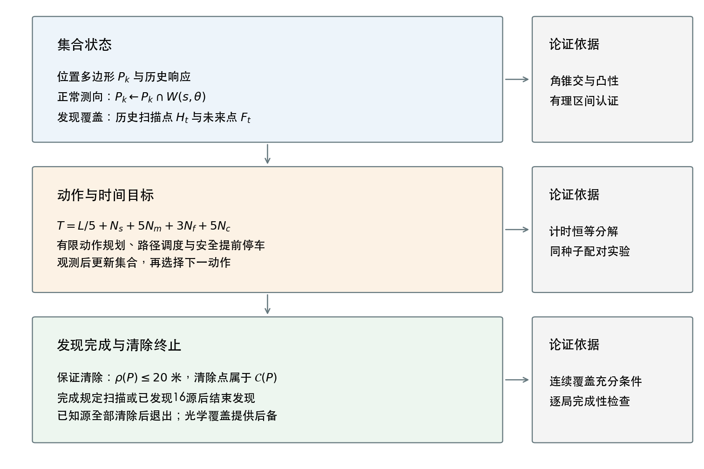

# 2026年全国大学生数学建模竞赛 B题

**有界测向误差下干扰源的连续几何规划与清除**

CUMCM 2026 Problem B: continuous geometric planning for radio-jammer localization and clearance under bounded bearing error.

本仓库是赛后开源材料。请先看 **[B题_最终提交](B题_最终提交/)**：其中有最终论文 PDF、支撑材料源码/数据，以及与竞赛交付一致的 ZIP。

<p align="center">
  
</p>

## 最终提交

| 文件 | 说明 |
| --- | --- |
| [B题论文_最终提交版_v4.pdf](B题_最终提交/B题论文_最终提交版_v4.pdf) | 最终论文（与支撑包内 `paper/main.pdf` 逐字节一致） |
| [B题论文及支撑材料_v4.zip](B题_最终提交/B题论文及支撑材料_v4.zip) | 竞赛交付整包（小于 20 MB） |
| [B题支撑材料](B题_最终提交/B题支撑材料/) | 可浏览的源码、结果、证书、官方加密日志与 LaTeX |
| [修改说明](B题_最终提交/修改说明.md) | v4 相对前一版的校正范围 |

论文题目对应题面《无线电干扰源的快速自动定位与清除》。四问共用“集合估计—主动观测—邻域访问—安全终止”闭环：不确定量用角锥交、圆盘交和剩余覆盖集表示，决策只依赖集合与已用代价。

- **问题一**：前向角锥写成半平面交；单点清除判据是最小包围圆半径 \(\rho\le 20\) 米，不是直径 \(\le 40\) 米。
- **问题二**：完整保证接收域化为四个圆盘相交；完整首扇区一次补测后，35 米保证定位域为空。
- **问题三**：1124 米七点发现环 + 有限动作规划 + 集合测向定位。
- **问题四**：21 点双环的剩余覆盖证书，以及自适应光学条带终端清除。

推荐默认配置为**方法78**（`joint`，规划深度 2）。方法84是 Q4 连续发现点替换的实验候选，独立集上平均节省跨零，按预声明规则不推广。

## 主要结果

时间单位为秒。本地独立集每问 200 局，场景含 40 米源间距排斥，**不能**等同于官方分布。

| 口径 | Q3 | Q4 |
| --- | ---: | ---: |
| 默认方法78 总均时 | 3003.37 | 5733.40 |
| 候选84 总均时 | 3003.37 | 5704.99 |
| 84 相对 78 | 逐局相同 | 节省 28.41，95% 区间 \([-5.92, 62.75]\) |
| 独立集清除 | 200/200 | 200/200 |

六次官方正式测试（平台不公开源总数，清除比例以平台判定为准）：

| 问题 | 案例编码 | 清除数 | 平均定位清除时间 / s | 程序运行时间 / s |
| --- | --- | ---: | ---: | ---: |
| Q3-1 | 42PD-EFKH-MB35-HUGM | 11 | 254.474 | 2.074 |
| Q3-2 | 64KQ-SEGG-VQCH-M8C8 | 14 | 215.121 | 1.624 |
| Q3-3 | B4WR-YVMD-JQQV-XFTP | 14 | 217.592 | 2.089 |
| Q4-1 | ZHZN-TEBH-HMAG-FFDG | 15 | 366.344 | 4.742 |
| Q4-2 | WMJX-EKTD-KPRD-786W | 10 | 575.192 | 5.361 |
| Q4-3 | MTHU-N87U-YWR2-3RRK | 10 | 558.222 | 4.908 |

合计清除 74 个，HTTP 错误 0，均主动退出。问题三、四加权均时分别为 227.107 与 480.837 秒/个。加密 `.jlog` 原件在 [`official-logs/`](B题_最终提交/B题支撑材料/official-logs/)。

## 复现

```bash
git clone https://github.com/Wu-Chenjie/math_model.git
cd math_model/B题_最终提交/B题支撑材料
python -m pip install -r requirements.txt
python run_all.py
```

- 需要 Python 3 与 C++17 编译器（`g++` / `clang++`，可用 `CXX` 指定）。
- 默认入口编译机器人、重建总览图并运行核心回归与几何证书，**不**重跑全部历史仿真。
- `python run_all.py --full` 重跑固定独立集与压力集。
- `python run_all.py --paper` 从冻结 CSV 重建图、源码附录与 PDF，另需 XeLaTeX / ctex。
- `vendor/mocksim/` 依据公开协议实现，**不是**官方模拟器。
- 在线接入官方模拟器时，队号只作为命令行参数临时输入，不写入本仓库。

哈希清单见 [`PACKAGE_HASHES.json`](B题_最终提交/B题支撑材料/PACKAGE_HASHES.json)。更细的复现边界写在[支撑材料 README](B题_最终提交/B题支撑材料/README.md)。

## 仓库里的其他目录

| 目录 | 角色 |
| --- | --- |
| `B题_最终提交/` | **请从这里开始**：v4 论文与支撑材料 |
| `B题几何策略优化/` | 几何证书与方法 78/84 的完整工作树（含后续补充分析） |
| `B题成果/`、`B题优化/`、`B题深化/`、`B题鲁棒优化/`、`B题联合优化/`、`B题连续规划优化/` | 赛中迭代，保留供对照，不是最终提交 |
| `题解/`、`题解2/`、`题解2.1/` | 同期 C 题工作树，与 B 题相互独立 |

## 说明

材料仅供学习与复现。正式成绩以竞赛组织方记录为准；本地全部清除不能替代官方正式测试。支撑包已去掉含队号的明文日志与本机绝对路径，题目要求保留的六份官方加密日志未改名、未编辑。
