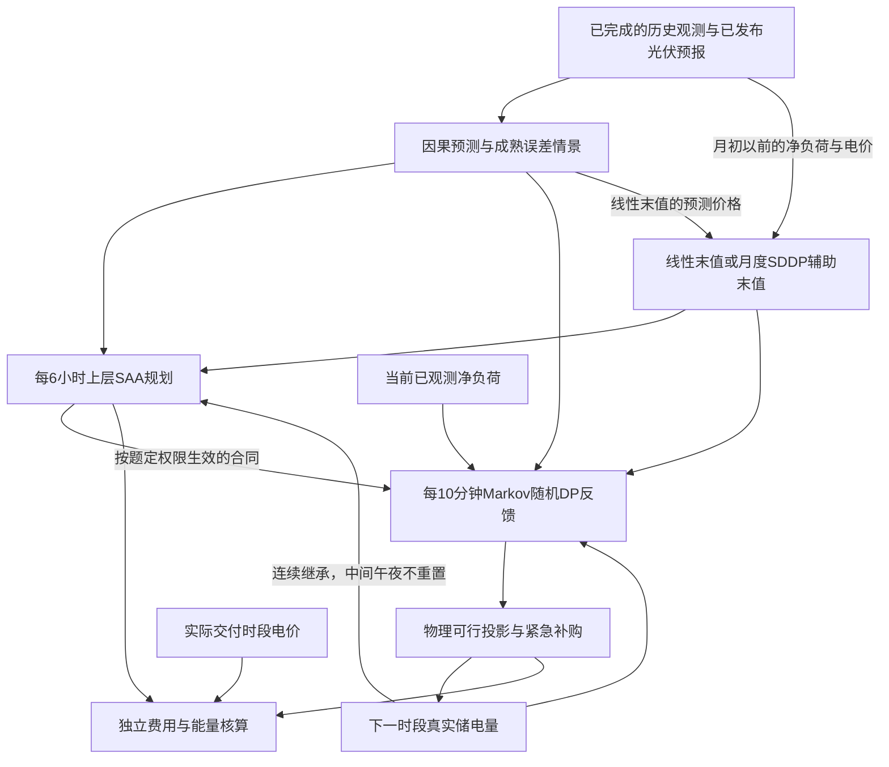

# C题跨日随机控制：模型与推导

本目录对应2026年全国大学生数学建模竞赛C题《微网与外部电网电力调控策略》。原题和附件副本在inputs，原始输入不作修改。这里提供模型、程序、计算和审查资料，供手工撰写论文；没有生成参赛论文。

## 一、从四问结构确定模型

第一问给定全天负载、光伏和电价，求带首末库存约束的确定性线性规划。第二问只有历史负载与光伏，可在0点签署当日合同，实际短缺以五倍电价补购。第三问增加0、6、12、18点发布的未来24小时光伏预报及日内合同调整。第四问分别在第二、三问上加入未知的浮动电价。

共同困难是库存跨时段耦合，且合同早于部分实际信息确定。将每个午夜p强制设成6000 kWh会切断这种耦合。新模型只在2025年1月1日初始化一次；第二至四问允许各午夜库存由前一日自然传递。主计算采用题目未额外限制的年末自由库存，另用一次全局期末6000作可比性检验。第一问仍保留题给的首末相等条件。

图示为主反馈结构；仿射反馈是另行比较的下层备选。所有候选使用同一结算公式，实际电价仅进入核算。图中的末值在真实自由终点为零，SDDP末值只在清空旧合同的午夜接口使用库存作为连续可控状态。

1月采用共同的可行暖启动：电池不充放、普通计划购电为零，已观察的短缺用紧急电补足、富余弃置。它从题给初值物理地保持至2月1日；其费用单列，所有候选使用同一暖启动，不把1月底补能费移出评价期。1月的数据用于模型开发；正式结果为2月1日至12月31日334天。该暖启动是清楚可复现的初始化政策，不声称它使1月费用最小。

## 二、假设及符号

|符号|含义|单位或取值|
|---|---|---|
|τ，d，t|全局时段、日期、日内时段|每步10分钟，每日144步|
|Δ|时间步长|1/6小时|
|L，V|负载、光伏功率|kW|
|n=Δ(L−V)|净需求电量，可为负|kWh|
|q，r|当日0点原合同、当前生效合同|母线侧kWh，非负|
|c，b|母线侧充电量、放电量|kWh，非负|
|E|电池内部储存电量|kWh|
|e，w|紧急补购、富余弃电|kWh，非负|
|p|交付时段结算电价|元/kWh|
|η|单向充电、放电效率|主解释各为0.9|
|M|每步母线侧充/放电量上限|5000/6 kWh|
|Iτ|决策时已经可得的信息|历史实测、已发布预报、现存合同、SOC|
|S，H|经验场景数、滚动截断时刻|主场景数7，通常覆盖完整下一日|
|λ|线性末值中的库存替代费用系数|元/内部kWh|

题给电池容量12000 kWh，允许库存区间[1200,10800]，初始6000，功率上限5000 kW。以下补充假设须在论文中披露：输入功率按前一10分钟区间均值积分；不售电、允许免费弃置富余；未给出的外网容量、电池老化、自放电和线损不另造参数；当前10分钟净负荷可在电池动作前观测，未来实值不可见。第四问实际当前价格仍只用于结算，动作使用历史条件预测价。

程序state数组及结果表的“SOC/kWh”均表示储电量E；严格的归一化荷电状态为SOC=E/12000。论文符号宜以E表示kWh库存，以SOC表示比例，避免单位混用。若改为允许动作前观察当前实时电价，应把该信息加入下层反馈并另行回放，当前费用不代表这一更强信息结构下的最优值。

原模板时间段整体晚10分钟，输出副本统一为00:00–00:10至23:50–24:00。把功率当区间均值、把90%解释为单向效率、退购退款及最终净额结算都属于有实质影响的口径；不应写成题面已无歧义地规定。

弃电变量表示母线总富余的弃置，可能包含购入电能；其统计值不能直接命名为光伏弃电量，也不足以识别纯光伏利用率。若把退购解释为原电费不退、另加违约费，须更改目标并重算，不能复用本目录费用数字。

## 三、物理模型及无需整数变量的理由

\[
r_\tau+e_\tau+b_\tau-c_\tau-w_\tau=n_\tau,
\quad E_{\tau+1}=E_\tau+\eta c_\tau-b_\tau/\eta,
\]
\[
1200\le E_\tau\le10800,\qquad0\le c_\tau,b_\tau\le M.
\]

允许弃电且价格为正时，可去掉充放电互斥二进制变量。若c、b同时为正，取a=min(c,b/η²)，用c−a、b−η²a替代；库存变化不变，母线净耗电减少(1−η²)a，至少一个动作变为零，费用不增加。

令δ=E_next−E，取无同时充放的实现c=δ⁺/η、b=η(−δ)⁺，则

\[
-M/\eta\le\delta\le\eta M,\qquad
e\ge0,\quad e\ge n-r+\eta\delta,\quad e\ge n-r+\delta/\eta.
\]

这些约束均为线性，故经验场景计划仍是LP。执行中只将请求的下一库存投影到

\[
[1200,10800]\cap[E-M/\eta,E+\eta M].
\]

跨日时直接令E_(d+1,0)=E_(d,144)，不投影到6000。若一个对照实验确实有全局终点E_T=6000，在本次动作之后还剩N步时，再与[6000−NηM,6000+NM/η]相交。N按真正实验终点计算，不按日末或移动时域截断点计算。

## 四、统一费用及第一问

采用相对本日0点合同的最终净额结算：

\[
\phi(q,r)=q+1.5(r-q)^+-0.5(q-r)^+
=\max(1.5r-0.5q,\ 0.5r+0.5q).
\]

总费用是Σ p[φ(q,r)+5e]。每段的原q不能被一次调约覆盖成新基准；不同日期分别保存自己的0点q。q=100、r=80、p=1时普通合同净费为90；r=120时为130。没有现金流约束和折扣时，可以在交付阶段只计一次总净费；这不是主张实际付款时间改变。

第一问固定e=0、r=q、E_0=E_144=6000，最小化Σpq。它是确定性LP，可报告求解器最优状态、对偶差和约束残差。其确定性最优性不能外推为第二至四问的随机全局最优。

## 五、可得信息、预测和跨日场景

每一发布节点先读取截至当前时刻的历史与当次正式预报，再签约或调整；交付阶段才揭示当前净负荷、执行电池反馈与紧急补购。后续实测价格仅进入记账。签约前不能观察本段尚未实现的净负荷。

负载、光伏和价格从lag1、lag7、mean7、trend7四种预测家族中按1月15–31日MAE选型，随后冻结。它是开发期选型，不是这些1月分数已经样本外无偏。日内使用已过去最多6小时的平均预测误差，乘0.8并以6小时尺度衰减来修正未来自建预测。0.8为稳定化选择，非题给常数。第四問的价格预测和情景至少取0.001，实际结算价不截断。

第三问从附件3原24个小时值出发，以发布前最后一段已观测光伏作零小时锚点，按绝对目标时刻插值，完整使用已经发布的24小时信息，包括次日部分。尚未发布的明日预测缓存不允许提前读取。超过当前已发布范围的光伏使用历史预测。

场景来自相同发布时刻的连续多日联合残差块。假设当前信息截断为a，拟预测T步；历史块从h开始，必须满足h+T≤a。仅h<a不够，因为“昨天发布”的预报可能覆盖今天尚未发生的时间。当前预测加历史净负荷残差形成n_s，浮动价格使用同一历史块的价格残差，保留块内联合变化。最近28个成熟块中按时间均匀抽取7个作等权经验情景；这是情景缩减，不是声称7个情景已复原真实分布。

每个决策记录as_of、预测末时刻、历史块日期、最后训练目标时刻以及可用官方预报覆盖长度。因果扰动检验直接改动尚未发生的实测和尚未发布的预报，核对此前预测、场景和合同是否保持一致。

## 六、跨日因果仿射策略SAA-MPC

每6小时重建滚动计划。时域通常延伸到下一完整日结束，随当前时刻约为24–48小时；真实评估终点附近按终点截断。第二问重算电池与未来日计划时，本日已签q始终锁定；第三问仅在题目允许的0/6/12/18点发布实际合同。

这是固定6小时重规划的滚动控制：第三问与题定官方信息发布节点对齐，第二问的6小时只是自主选取的内部时钟，并不表示题面在这些时刻提供新官方预报。本实现不命名为已经实现误差阈值式事件触发MPC。下层每10分钟依据新实测执行反馈，但并非每10分钟重新解上层LP。既然本轮计算成本不设预算，额外用阈值跳过允许更新的节点缺少必要性，而且会引入阈值调参。鲁棒最坏情景、风险厌恶CVaR、Lyapunov在线调度或学习型价值函数可以形成后续候选；本轮未计算它们，不将“尚未比较的方法”概括为被现方案击败。

记ε_(s,t)=n_(s,t)−mean_s n_(s,t)，z_(s,t)=0.8z_(s,t−1)+0.2ε_(s,t)。未来状态采用

\[
E_{s,t+1}=a_t+g_{k,1}\epsilon_{s,t}+g_{k,2}z_{s,t},
\]

每个6小时块共享两项反馈增益。它只能利用截至本段已经揭示的净负荷，不使用后续误差。未来日q及未来允许调整的r也采用仿射决策规则，但其特征严格截到对应发布节点之前，使用发布前最近6小时平均误差及EMA。根节点待签合同在所有场景上共享；未来每一天均有自己的原q。增益约束[−10,10]定义受限策略类，单位是电量响应/电量误差。

将这些线性规则代入每条经验场景的库存、功率、非负合同和缺口约束，再引入φ的上图变量，求解

\[
\min\ \frac1S\sum_s\left\{\sum_{t=a}^{H-1}p_{s,t}[\phi(q_{s,t},r_{s,t})+5e_{s,t}]+\widehat V_H(E_{s,H})\right\}.
\]

末点对齐到旧合同清空、新日签约之前的午夜，因此末值只需以库存作为可控连续状态；预测/季节条件体现在当前末值版本中。若改为任意日内截断，末值必须同时保留未履行q/r，不能照搬单变量函数。

主线性末值为−λE，λ取当前可用价格情景中最后一个整日的25%分位电价除以η。它近似未来低价补能的替代费用，不是经证明的SDDP下界。常数λE_ref不影响决策，所以省略。真正自由年末末值为零；不能一直给年末虚构残值奖励。

前瞻的仿射策略类允许未来合同根据届时已经观测的净负荷变化，却没有额外模拟未来官方预报更新的创新。这是受限信息利用，并非偷看未来发布。实际到达下一发布节点后，使用那时新公布的完整预报重新优化。重优化执行与最初LP的完整仿射策略不同，不应将LP训练目标直接当成实际闭环费用。

仿射反馈备选直接执行上式当前状态请求；对训练场景之外的轨迹进行物理投影，缺口由紧急电保障。它只保证经验场景内的未投影策略约束，不是对所有可能误差均成立的鲁棒保证。实际账单必须由已执行轨迹另算。

## 七、Markov随机动态规划反馈

仅采用仿射反馈可能无法充分利用当前真实库存，故另比较一个一维凸随机动态规划控制器。每次重规划时，以当前已签合同和未来名义计划作为这次DP的固定参数；对当次SAA生成的净负荷情景，在每个未来时段分别按三分位分成三个可观测箱。同一情景路径上相邻时段的箱标签计数，加总量1的均匀伪观测得到转移矩阵。它并非直接对原历史实测序列分箱估计固定转移矩阵。每个箱内净负荷保留当次情景经验取值，价格采用箱内条件均值；空箱回退为全部S个情景。

在已知当前净负荷n后，对物理可行的下一库存x求

\[
\min_x 5\bar p_{t,k}\max\{0,n-r_t+\eta(x-E),n-r_t+(x-E)/\eta\}
+\sum_{k'}P_{t,kk'}V_{t+1,k'}(x).
\]

普通合同费在这次固定合同DP中与电池动作无关，故从动作优化省略，实际总账仍完整计入。日内V并非一个不依赖合同的通用函数：它条件于当前这套剩余合同和未来名义合同。未来合同在该下层近似中冻结，到了实际允许节点再由上层重新决定。因此不能把它描述为对所有未来自适应合同求出了精确Bellman解。

实现使用[1200,10800]上的321点等距网格储存凸分段线性值函数，但当前动作允许连续取值。令y=E−x，单期成本为凸分段线性函数h(y)，则

\[
\min_{x+y=E}\{V(x)+h(y)\}=(V\square h)(E).
\]

两个凸分段线性函数的下确界卷积可由斜率排序合并计算：各段的横向长度不变，按斜率从小到大依次拼接。之后对状态网格插值，再按噪声概率和Markov转移取期望。程序因此不必每10分钟重新解一个大LP，也没有由大模型估计数值。当前动作候选包括未来值函数折点、即时成本折点和物理边界；逐点计算选择最小值。

网格插值是凸弦近似；在所定义的固定合同离散Markov模型下，它一般给出近似上侧值，而不是SDDP下界。细化网格、改变场景数和时域用于检验这种近似对实际费用的影响。真实价格的箱内变化及更长历史依赖仍是模型误差来源。

全局期末6000对照在DP内部使用1000|E−6000|的有限惩罚近似，不能称为已证明精确惩罚；真实执行另有硬终端可达区间，确保规定的末库存。三日时域实验还会因“历史块须完整成熟”的条件改变可用残差块，费用差不宜全部归因于单独增加前瞻长度。

## 八、通用SDDP备选与原数据接入

`src/sddp.py`实现有限时域、风险中性、阶段独立有限噪声下的凸线性SDDP。通用接口接受各阶段LP矩阵、边界、费用和噪声概率，输入/输出状态维数可配置。应用者须给出有效的初始继续费用下界，并保证后续可行；不能把本电池应用的零下界套到含负费用或残值奖励的任意模型。

状态取X=(E,q_1,…,q_K,r_1,…,r_K)。每日先经过确定性签约阶段，q/r成为后续状态；第三问另在6/12/18点加入确定性调约阶段；交付阶段才观察当期噪声并控制电池，交付后清空对应q/r。各阶段只收一次交付费用φ与紧急费。库存在阶段间连续传递，没有午夜重置。

对固定输入状态\(\bar X\)求阶段LP，从固定等式的对偶乘子取得β。后向遍历所有当期噪声分支并按概率加权，构造

\[
\underline V_t(X)=\max_m\{\alpha_{m,t}+\beta_{m,t}^TX\},
\quad\alpha=\mathbb E[Q_t(\bar X,\xi)]-\beta^T\bar X.
\]

前向只抽取当前阶段噪声，得到可行策略访问的状态；后向在这些状态追加全局支撑割。当前电池模型所有费用非负，所以零下界有效；真实训练终点允许库存自由，继续费用为零。末端约束或成本变化时必须同步修改模型，不能仅修改文字解释。

原数据备选按月重训：只使用截点之前最多28个完整日（开发期截点为1月15日，正式回放为月初），按两小时聚合得到每日K=12段，三天有限时域，每段三个净负荷箱及条件价格，假定这些阶段创新独立。根签约之前旧合同为空，根割可降为α+βE。使用500次迭代，并额外以独立随机种子模拟64条策略路径；报告模型根下界、策略费用均值、标准误和正态近似区间。该区间不是确定上界，500次也不自动表示收敛。

这些割是**固定粗辅助模型**的有效下界；进入10分钟、历史联合情景和新预报条件下的MPC时，只是经实验比较的未来费用近似。粗化丢掉的细时段变化和长期误差依赖，不能由多做SDDP迭代弥补。下界相对于辅助模型成立，不相对于整个原题随机最优值成立。

有限评估期末采用匹配的辅助时域：MPC末点之后只余一日或两日时，调用同一历史截点训练的相应短模型；已到真实自由末点则继续费用为零。这既用于年末，也用于开发期有限子问题，避免虚构评估结束后的库存价值。

尾值版本按当前as_of所属月份选择，不能按未来截断点H所属月份偷读尚未训练的模型。模型重新拟合后从头生成割，不把旧分布的割当成新分布下界。对一维根割用上包络算法删除在[1200,10800]上从不激活的线，保留原包络并核验，而非随意抽取若干割。

独立审查另行使用显式充放电变量构造完整小场景树；在无调约和有调约两种情形比较SDDP根下界与全部路径策略值，并逐阶段检查割。小树验证证明的是实现机制，不是粗模型已能准确预测全年收益。

## 九、选型、对照与可声称的结论

候选包含共同路径计划加贪心反馈、因果仿射MPC、Markov随机DP反馈、SDDP末值的两种反馈组合，以及匹配时域和信息的每日闭合对照。开发期固定为1月25–31日；差异不超过开发费用0.01%时优先选择更简单的线性末值Markov反馈。正式2–12月结果不用于重新选择算法。各候选独立按整个时间序列运行，不逐日切换影子专家，也不把其SOC凭空换成另一个控制器库存。

两种SDDP反馈组合均参加开发期比较。根据开发期结果，全年SDDP备选保留Markov反馈组合，仿射反馈组合只报告开发期结果。全年表中六种方法均独立运行完整334天，不补造未运行的全年候选数字。

数据仅含2025年一个历史年度，正式比较为2—12月334日的连续回放。它不能证明跨年泛化、稳态平均成本或未来年度稳定收益，后续需要独立年份或新的运行期数据验证。

第三问“其他时刻的预报”若指在已有四个发布时点之外增加发布频率，附件未提供那些额外时点的预报序列。当前消融保持合同调整权限不变，只能测量现有发布在当前策略下的利用效果，不能据此推断新增时点的收益。评估新增发布需额外的带时间戳预报、误差分布和更新成本，并保持信息时序一致。

必须区分三种数值：Q1确定性LP最优值；受限经验策略LP的训练目标；真实历史连续闭环账单。SDDP另有自己固定辅助随机模型的下界和模拟估计。这些对象不能拼成一个“全局最优间隙”。

“去掉每日闭合不增加最优值”只在同一模型、同一信息结构、同一真正末端条件且求得最优值时成立。对近似闭环策略，费用可能升也可能降，应报告实际比较。主年度末端自由时也报告最后库存，避免把一次性消耗初始电量写成可持续套利收益。

最终数值、指定日期表、对照与审查结论由执行产物生成，见建模计算交接及计算结果。未执行的设置不能作为结果写进论文。

## 十、文献与代码对应

- 赛题与附件：全国大学生数学建模竞赛组委会官方发布入口 https://www.mcm.edu.cn/html_cn/node/27b6e148f8113f09b0269f64a02629fb.html 。计算以本地原PDF和附件及其哈希为准；未声称官网压缩包与本地逐字节相同。
- SDDP决策与随机量时序：https://sddp.dev/stable/tutorial/decision_hazard/ 。支持把先决策的合同放到前置阶段，本代码自行实现LP引擎，没有调用SDDP.jl。
- SDDP适用条件与相对完全追索：https://sddp.dev/stable/tutorial/warnings/ 。无限紧急电不能消除功率上限导致的终端库存不可达。
- 线性规划求解器：HiGHS，https://highs.dev/ 。实际版本及执行环境见运行日志。

|代码|功能|
|---|---|
|prepare_data.py|原附件读取、单位与日期审计、输入哈希|
|dispatch.py|第一问确定性LP及独立费用结算函数|
|forecasting.py|as-of预测、完整官方24h预报、成熟跨日残差|
|control.py|因果仿射策略LP、物理投影、凸Markov DP、根割上包络|
|sddp.py|通用有限时域SDDP、合同/交付阶段、粗未来模型训练|
|run.py|共同暖启动、候选顺序回放、月度训练、轨迹与执行日志|
|export_results.py / build_workbooks.mjs|指定日期、CSV和附件5格式工作簿|
|review/|独立公式验证、因果扰动、轨迹和最终交接审查|
